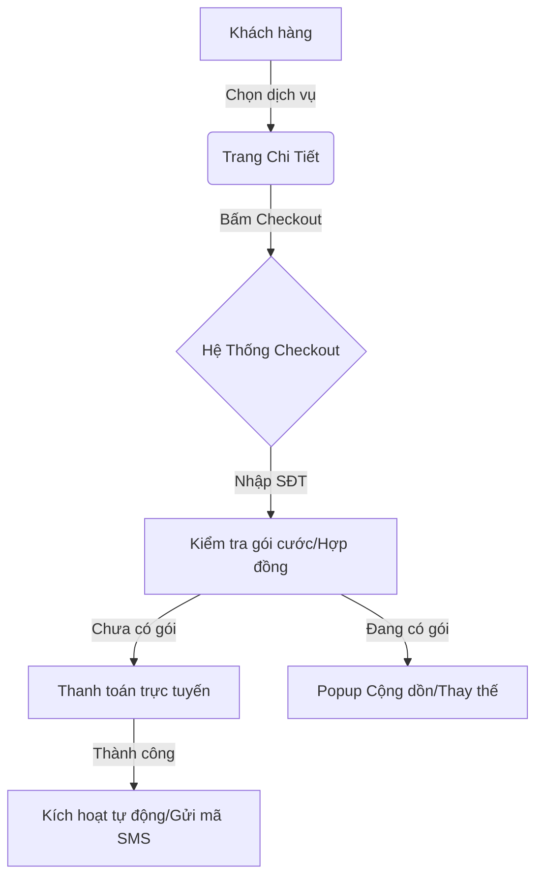

# USER REQUIREMENTS DOCUMENT (URD) - TÀI LIỆU YÊU CẦU NGƯỜI DÙNG

**Dự án:** [Tên Dự Án/Hệ Thống]
**Mã hiệu:** [Mã hiệu tài liệu - VD: FPT-URD-CHECKOUT-01]
**Phiên bản:** [Phiên bản hiện tại - VD: 1.0]
**Tác giả:** [Tên BA soạn thảo]
**Ngày lập:** [Ngày/Tháng/Năm]

---

## REVISION HISTORY (LỊCH SỬ THAY ĐỔI)
*Ký hiệu hành động: [A]: Add – Thêm mới | [U]: Update – Cập nhật, thay đổi | [D]: Delete - Xóa*

| Date | Version | Author | Action | Change Description |
| :--- | :--- | :--- | :---: | :--- |
| [Ngày/Tháng/Năm] | [V1.0] | [Tên tác giả] | [A] | Khởi tạo tài liệu, cấu trúc luồng tổng quát |
| | | | | |

---

## MỤC LỤC
A. GIỚI THIỆU
B. TỔNG QUAN HỆ THỐNG
C. ĐẶC TẢ CHI TIẾT CÁC CHỨC NĂNG
D. YÊU CẦU PHI CHỨC NĂNG
E. PHỤ LỤC & TÀI LIỆU THAM KHẢO

---

## A. GIỚI THIỆU

### 1. Mục đích tài liệu
Tài liệu này mô tả và phác thảo chi tiết các yêu cầu của người dùng cuối nhằm:
- Giúp đơn vị yêu cầu (ĐVYC) và các thành viên dự án (PM, BA, Dev, QA) xác định đúng và đủ phạm vi yêu cầu.
- Làm cơ sở và đầu vào duy nhất cho các quá trình:
  - Thu thập, phân tích yêu cầu nâng cao, đưa ra Đặc tả yêu cầu phần mềm (SRS).
  - Phân tích thiết kế hệ thống và thiết kế cơ sở dữ liệu.
  - Lập trình, phát triển phần mềm.
  - Xây dựng kịch bản kiểm thử (Test Cases) và thực hiện kiểm thử phần mềm (QA/QC).
  - Nghiệm thu sản phẩm (UAT).

### 2. Thông tin chung
| STT | HẠNG MỤC | MÔ TẢ CHI TIẾT |
| :---: | :--- | :--- |
| 1 | **Giới thiệu tổng quan** | [Mô tả ngắn gọn bối cảnh dự án, tính năng mới hoặc hệ thống sắp xây dựng] |
| 2 | **Hiện trạng hệ thống (AS-IS)**| [Mô tả quy trình hiện tại, hệ thống cũ đang gặp những khó khăn, bất cập hay lỗi gì cần giải quyết] |
| 3 | **Mục tiêu kỳ vọng (TO-BE)** | [Các mục tiêu cụ thể, KPI hoặc hiệu quả mong muốn đạt được sau khi triển khai hệ thống mới] |
| 4 | **Phạm vi triển khai** | **- Phạm vi kỹ thuật:** [Các nền tảng Web, App, Backend, CMS... áp dụng] **- Phạm vi nghiệp vụ:** [Các luồng quy trình nghiệp vụ được bao phủ] **- Phạm vi tổ chức:** [Các phòng ban, đối tượng sử dụng hoặc khu vực áp dụng] |

### 3. Thuật ngữ và viết tắt
| STT | THUẬT NGỮ | NGHĨA TIẾNG ANH / TÊN ĐẦY ĐỦ | MÔ TẢ Ý NGHĨA |
| :---: | :--- | :--- | :--- |
| 1 | URD | User Requirements Document | Tài liệu yêu cầu người dùng |
| 2 | SKU | Stock Keeping Unit | Đơn vị phân loại hàng hóa/dịch vụ |
| 3 | COD | Cash On Delivery | Thanh toán trực tiếp khi nhận hàng |
| 4 | FID | Flexible ID / Flow ID | Luồng kích hoạt/định danh linh hoạt |
| 5 | [Thuật ngữ] | [Tên đầy đủ] | [Giải thích ngắn gọn] |

---

## B. TỔNG QUAN HỆ THỐNG

### 1. Sơ đồ luồng nghiệp vụ tổng quan (Business Workflow / Context Diagram)
*[Vẽ sơ đồ Mermaid thể hiện luồng đi tổng quát giữa các tác nhân và hệ thống, hoặc chèn link hình ảnh]*

### 2. Danh sách các chức năng (Functional List)
| STT | Module / Chức năng | Version | Loại (New/Update/Delete) | Mô tả tóm tắt hành vi hệ thống |
| :---: | :--- | :---: | :---: | :--- |
| 1 | [Luồng checkout DV FPT Play SA] | [2.1] | [Update] | [Đặc tả các bước nhập thông tin, kích hoạt tài khoản tự động hoặc qua SMS đối với dịch vụ FPT Play SA] |
| 2 | [Chức năng X] | [1.0] | [New] | [Mô tả tóm tắt...] |

### 3. Ma trận quyền (Permission Matrix)

#### Bảng Định nghĩa Quyền (Permission Definition List)
| Mã Quyền | Tên Quyền | Mô tả chi tiết hành vi |
| :---: | :--- | :--- |
| **F** | Full Access | Toàn quyền thao tác trên module (Xem, Thêm, Sửa, Xóa) |
| **A** | Add | Tạo mới dữ liệu |
| **U** | Update | Cập nhật, chỉnh sửa thông tin |
| **D** | Delete | Xóa dữ liệu (có thể ràng buộc theo nhóm quyền đặc biệt) |
| **V** | View | Xem thông tin chi tiết |
| **L** | List | Xem thông tin dưới dạng danh sách |
| **E** | Export | Xuất file báo cáo (Excel, PDF...) |
| **I** | Import | Nhập dữ liệu hàng loạt từ file Excel |

#### Bảng Phân quyền Module (Permission Matrix Table)
| STT | Tên Chức năng / Module | Role Admin | Role Sales | Role Khách hàng | Ghi chú |
| :---: | :--- | :---: | :---: | :---: | :--- |
| 1 | Quản lý cấu hình dịch vụ | F | V, L | N/A | Chỉ Admin được cấu hình |
| 2 | Đăng ký & Checkout dịch vụ | V, L | A, U, V | A, V | Người dùng cuối thực hiện thanh toán |

---

## C. ĐẶC TẢ CHI TIẾT CÁC CHỨC NĂNG

### I. [Tên Chức Năng / Module 1]

#### 1. Luồng Nghiệp Vụ (Business Workflow)
*[Mô tả kịch bản sử dụng (Use Case Scenario) chi tiết từ lúc bắt đầu đến khi kết thúc. Chia rõ các bước thao tác của người dùng và phản hồi tương ứng của hệ thống]*

- **Tác nhân tham gia:** [Ví dụ: Khách hàng vãng lai, Khách hàng đã đăng nhập, Nhân viên CSKH...]
- **Điều kiện bắt đầu (Pre-conditions):** [Ví dụ: Khách hàng đã chọn sản phẩm từ trang chi tiết và bấm nút "Thanh toán"]
- **Luồng xử lý chi tiết (Step-by-step):**
  - **Bước 1:** Khách hàng mở màn hình Checkout. Hệ thống hiển thị thông tin sản phẩm đã chọn, giá gốc, giá khuyến mãi và các phương thức thanh toán khả dụng.
  - **Bước 2:** Khách hàng nhập thông tin cá nhân (Số điện thoại, Họ tên, Email). Hệ thống thực hiện kiểm tra định dạng dữ liệu tự động.
  - **Bước 3:** Khách hàng thực hiện chọn phương thức thanh toán và áp dụng mã ưu đãi (nếu có). Hệ thống tính toán lại số tiền cần thanh toán thực tế (Real-time).
  - **Bước 4:** Khách hàng bấm nút "Thanh toán". Hệ thống gọi API cổng thanh toán tương ứng.
  - **Bước 5:** Thanh toán thành công, hệ thống tiến hành kích hoạt dịch vụ tự động và hiển thị màn hình hoàn tất đơn hàng.
- **Điều kiện kết thúc (Post-conditions):** [Ví dụ: Tạo đơn hàng thành công trên hệ thống SPF, gửi thông báo kích hoạt thành công qua SMS/Email cho khách hàng]

#### 2. Quy tắc Nghiệp Vụ (Business Rules)
*[Đặc tả chi tiết các thuật toán, điều kiện kiểm tra dữ liệu, logic xử lý phức tạp hoặc các ràng buộc nghiệp vụ]*

| Mã Rule | Tên Quy tắc | Nội dung quy tắc chi tiết |
| :---: | :--- | :--- |
| **[CODE]-BR-01** | Bắt buộc nhập Số điện thoại | Số điện thoại khách hàng nhập là bắt buộc, phải là định dạng số di động Việt Nam (10 chữ số, đúng các đầu số nhà mạng). SĐT này dùng làm tài khoản định danh kích hoạt dịch vụ. |
| **[CODE]-BR-02** | Logic Cộng dồn / Thay thế gói | - Nếu SĐT đang sử dụng gói dịch vụ tương đương: Cho phép mua cộng dồn thời hạn sử dụng cước. Ngày hết hạn mới = Ngày hết hạn cũ + Chu kỳ mua mới. - Nếu SĐT đang sử dụng gói khác loại: Khi thanh toán thành công, gói mới sẽ thay thế gói cũ, số tiền còn dư của gói cũ (nếu có) sẽ được quy đổi tương đương số ngày sử dụng gói mới theo công thức tính toán tự động. |
| **[CODE]-BR-03** | Ràng buộc nhận Hóa đơn | Khi người dùng tick chọn "Tôi muốn nhận hóa đơn", tất cả các trường thông tin: Tên tổ chức/Cá nhân, Email nhận hóa đơn, Mã số thuế (nếu có), Địa chỉ xuất hóa đơn đều trở thành trường bắt buộc nhập (Required). |

#### 3. Mô tả Giao diện & Ràng buộc Trường (Screen Description)
*[Bảng chi tiết mô tả tất cả các điều khiển giao diện (Control), kiểu hiển thị, ràng buộc dữ liệu đầu vào và phản hồi UI tương ứng]*

| STT | Field / Element | Kiểu dữ liệu | Ràng buộc dữ liệu / Validation | Liên kết Rule | Thao tác người dùng & Phản hồi hệ thống |
| :---: | :--- | :--- | :--- | :---: | :--- |
| 1 | **Số điện thoại** | Textbox / Number | - Bắt buộc nhập (Required) - Chỉ cho phép số [0-9] - Độ dài chuẩn 10 chữ số | [CODE]-BR-01 | - Người dùng: Nhập SĐT. - Hệ thống: Kiểm tra hợp lệ khi người dùng chuyển focus khỏi trường. Nếu lỗi, hiển thị text đỏ cảnh báo: *"Số điện thoại không hợp lệ!"* |
| 2 | **Nhận hóa đơn** | Checkbox | - Mặc định: Unchecked - Không bắt buộc | [CODE]-BR-03 | - Người dùng: Click chọn tick/untick. - Hệ thống: Nếu Checked, mở rộng hiển thị phần nhập thông tin Hóa đơn ở phía dưới. Nếu Unchecked, ẩn đi. |
| 3 | **Nút "Thanh toán"**| Button | - Chỉ active khi tất cả trường bắt buộc đã điền hợp lệ | N/A | - Người dùng: Click nút. - Hệ thống: Kiểm tra tính hợp lệ toàn màn hình. Nếu hợp lệ, hiển thị overlay loading và chuyển hướng sang cổng thanh toán. |

#### 4. Các trường hợp lỗi & Thông báo hiển thị (Error Messages & UI Scenarios)
*[Bảng liệt kê tất cả các kịch bản ngoại lệ, lỗi hệ thống, lỗi kết nối và cách giao diện ứng dụng xử lý hoặc hiển thị thông tin lỗi cho người dùng]*

| STT | Giai đoạn / Tình huống | Thông báo hiển thị chính xác | Hành vi UI & Xử lý hệ thống |
| :---: | :--- | :--- | :--- |
| 1 | **Nhập liệu** Bỏ trống trường bắt buộc | *"Vui lòng nhập đầy đủ các trường thông tin bắt buộc!"* | - Focus vào trường trống đầu tiên. - Viền trường chuyển màu đỏ. - Hiển thị text báo lỗi inline bên dưới. |
| 2 | **Thanh toán** Lỗi giao dịch từ Ngân hàng | *"Thanh toán thất bại. Giao dịch không thành công từ phía ngân hàng. Vui lòng thử lại!"* | - Giữ người dùng ở màn hình Checkout. - Hiển thị thông báo dạng Alert Popup cảnh báo. - Cho phép người dùng chọn phương thức thanh toán khác để thử lại. |
| 3 | **Kích hoạt** Lỗi hệ thống không tạo được mã code | *"Lấy mã kích hoạt không thành công. Vui lòng liên hệ 1900 6600 để được hỗ trợ!"* | - Hiển thị dòng text thông báo màu đỏ ngay tại vị trí hiển thị Code. - Nút "Kích hoạt dịch vụ" bị disable (ẩn mờ). - Ghi log lỗi chi tiết lên hệ thống quản trị (Admin). |

---

## D. YÊU CẦU PHI CHỨC NĂNG

### 1. Hiệu năng hệ thống (Performance)
- **Thời gian phản hồi:** Thời gian tải trang Checkout và hiển thị thông tin thanh toán không quá 2 giây trong điều kiện mạng bình thường.
- **Tính toán Real-time:** Thời gian tính lại tiền khi áp dụng voucher hoặc thay đổi phương thức thanh toán không quá 0.5 giây.
- **Tải đồng thời:** Hệ thống đáp ứng được tối thiểu [1,000] giao dịch checkout đồng thời mà không bị nghẽn mạng hoặc mất dữ liệu.

### 2. Bảo mật & An toàn thông tin (Security)
- **Mã hóa thông tin:** Mọi dữ liệu truyền tải giữa Client và Server trong luồng thanh toán phải được mã hóa qua giao thức HTTPS (TLS 1.3).
- **Che dấu dữ liệu nhạy cảm (Masking):** 
  - Số điện thoại hiển thị trên màn hình Hoàn tất đơn hàng phải được che giấu (VD: `098***1234`).
  - Không được lưu trữ thông tin thẻ tín dụng của khách hàng trực tiếp tại DB hệ thống; việc xử lý thẻ phải được ủy quyền hoàn toàn cho cổng thanh toán đạt chứng chỉ PCI-DSS.

### 3. Trải nghiệm người dùng & Giao diện (UI/UX)
- **Responsive Design:** Giao diện màn hình Checkout phải tương thích và tối ưu hiển thị trên cả thiết bị di động (Responsive Web/App) và máy tính để bàn (Desktop).
- **Duy trì phiên làm việc (Session Retention):** Trong quá trình đang xử lý thanh toán và kích hoạt (Pending), hệ thống phải hiển thị màn hình khóa (Overlay Loading) kèm cảnh báo *"Hệ thống đang thực hiện kích hoạt dịch vụ, quý khách vui lòng không tắt màn hình!"* nhằm ngăn chặn hành động reload trang gây lỗi giao dịch.
- **Tải ứng dụng (PC Only):** Nút tải ứng dụng PC chỉ cho phép tải file cài đặt `.exe` nếu hệ thống phát hiện User-Agent là thiết bị chạy Windows. Với các hệ điều hành khác (Mac, iOS, Android), hiển thị popup hướng dẫn chi tiết tải phiên bản ứng dụng tương ứng trên App Store / Google Play.

---

## E. PHỤ LỤC & TÀI LIỆU THAM KHẢO
- **Link thiết kế UI/UX (Figma/Mockups):** [Chèn link Figma tại đây]
- **Tài liệu đặc tả API tích hợp cổng thanh toán:** [Chèn link tài liệu API]
- **Danh mục Tỉnh/Thành, Phường/Xã chuẩn hóa:** [Chèn link file danh mục]
