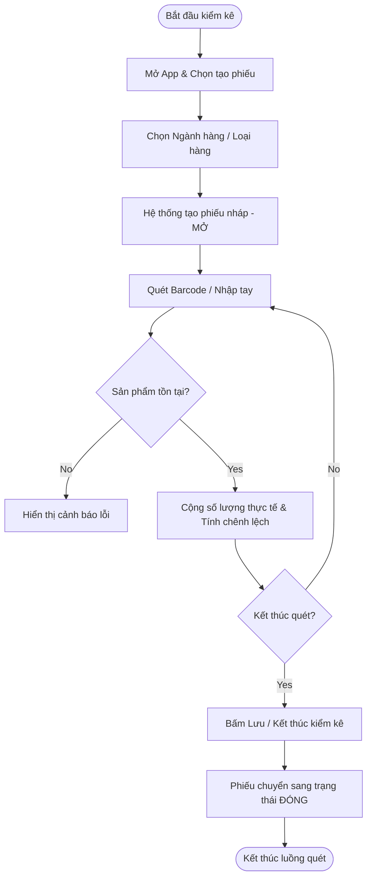
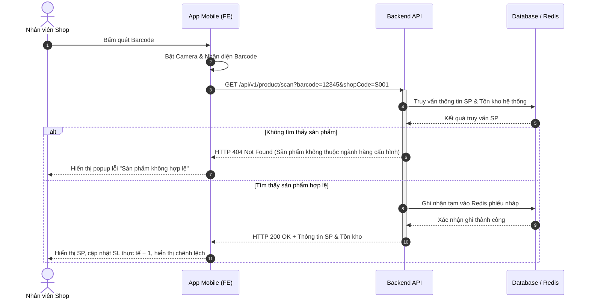

# USER STORY SPECIFICATION TEMPLATE (US-SPEC) - TÀI LIỆU ĐẶC TẢ USER STORY CHI TIẾT
*(Dành cho Business Analyst Senior / Product Owner)*

**Dự án:** [Tên Dự Án/Hệ Thống]
**Epic/Module:** [Tên Epic hoặc Module cha - VD: Epic Kiểm kê Tự động]
**User Story ID:** [Mã hiệu US - VD: US-INV-001]
**User Story Name:** [Tên User Story - VD: Quét barcode kiểm kê hàng hóa]
**Phiên bản:** [VD: 1.0]
**Tác giả (BA):** [Tên BA phụ trách]
**Ngày lập:** [Ngày/Tháng/Năm]

---

## REVISION HISTORY (LỊCH SỬ THAY ĐỔI)
*Hành động: [A]: Add - Thêm mới | [U]: Update - Cập nhật | [D]: Delete - Xóa*

| Ngày tiếp nhận | Version | Người chịu trách nhiệm | Hành động | Mô tả chung thay đổi     | Trước thay đổi (As-Is) | Sau thay đổi (To-Be)        |
| :---------------| :--------| :-----------------------| :---------:| :-------------------------| :-----------------------| :----------------------------|
| [dd/mm/yyyy]   | V1.0    | [Tên BA]               | [A]       | Khởi tạo tài liệu đặc tả | N/A                    | Khởi tạo tài liệu đặc tả US |
|                |         |                        |           |                          |                        |                             |

---

## PIC & TIMELINE (NHÂN SỰ & MỐC THỜI GIAN)

| Link Ticket (Jira/Redmine) | Deadline Golive | Ngày thực tế Golive | Business User (BU) | Business Analyst (BA) | Front-end Developer | Back-end Developer | QC Lead/Tester |
| :--- | :--- | :--- | :--- | :--- | :--- | :--- | :--- |
| [Link ticket] | [dd/mm/yyyy] | [dd/mm/yyyy] | [Tên BU] | [Tên BA] | [Tên FE Dev] | [Tên BE Dev] | [Tên Tester] |

---

## DANH MỤC TỪ VIẾT TẮT

| Từ viết tắt | Ý nghĩa đầy đủ (Tiếng Anh / Tiếng Việt) | Mô tả chi tiết / Bối cảnh sử dụng |
| :---: | :--- | :--- |
| **US** | User Story | Câu chuyện người dùng, đơn vị yêu cầu nhỏ nhất trong Agile |
| **AC** | Acceptance Criteria | Tiêu chí nghiệm thu cho User Story |
| **BR** | Business Rule | Quy tắc nghiệp vụ bắt buộc hệ thống tuân thủ |
| **KSNB** | Kiểm soát nội bộ | Bộ phận giám sát quy trình và chất lượng vận hành |
| **[TỪ MỚI]** | [Ý nghĩa đầy đủ] | [Mô tả chi tiết] |

---

## 1. MÔ TẢ CHUNG VỀ YÊU CẦU (GENERAL INFORMATION)

> [!NOTE]
> Phần này giúp định vị giá trị của User Story trong tổng thể nghiệp vụ. BA cần trả lời ngắn gọn các câu hỏi W-H dưới đây để đảm bảo hiểu đúng bài toán trước khi đi vào kỹ thuật.

### 1.1. User Story Card (Khung phát biểu chuẩn)
*   **As a (Với vai trò là):** [Actor/Role sử dụng - VD: Nhân viên shop FPTShop]
*   **I want to (Tôi muốn thực hiện):** [Hành động/Tính năng mong muốn - VD: Quét barcode của sản phẩm bằng camera điện thoại tại màn hình kiểm kê]
*   **So that (Để đạt được):** [Giá trị nghiệp vụ/Mục đích - VD: Hệ thống tự động ghi nhận số lượng kiểm kê thực tế và tính toán chênh lệch so với tồn kho hệ thống]

### 1.2. Phân tích W-H Questions
| W-H Question | Câu hỏi nghiệp vụ | Câu trả lời (Đặc tả bối cảnh chi tiết) |
| :---: | :--- | :--- |
| **WHAT** | Tính năng này cụ thể là gì? | [VD: Quét barcode tự động nhận diện mã sản phẩm/Imei, ghi nhận số lượng và so sánh chênh lệch tồn kho] |
| **WHY** | Tại sao cần tính năng này? (Nỗi đau/Painpoint cần giải quyết) | [VD: Rút ngắn thời gian đếm hàng thủ công, hạn chế sai sót khi nhập tay số Imei/Barcode dài, phục vụ giải trình chênh lệch lập tức] |
| **WHEN** | Khi nào tính năng này được kích hoạt/sử dụng? | [VD: Khi KSNB yêu cầu shop thực hiện kiểm kho định kỳ hoặc đột xuất] |
| **WHO** | Ai sẽ là người thao tác chính? | [VD: Nhân viên cửa hàng hoặc Quản lý cửa hàng (Store Manager)] |
| **WHERE** | Thao tác trên nền tảng/Platform nào? | [VD: Ứng dụng Mobile (iOS & Android) phục vụ tính cơ động khi đi đếm hàng] |
| **HOW** | Cách thức hoạt động cốt lõi là gì? | [VD: Mở camera quét barcode -> Gọi API kiểm tra và lấy thông tin SP -> Hiển thị số lượng chênh lệch -> Xác nhận & Lưu kết quả] |

---

## 2. QUY TRÌNH & PHÂN QUYỀN (PROCESS & PERMISSIONS)

### 2.1. Ma trận Phân quyền (Permission Matrix)
Đặc tả chi tiết các quyền hạn thao tác đối với User Story này dựa trên Chức danh/Mã chức danh.

| STT | Hành động / Chức năng chi tiết | Nhân viên Shop | Quản lý Shop | Kiểm soát nội bộ | Admin hệ thống | Ghi chú ràng buộc |
| :---: | :--- | :---: | :---: | :---: | :---: | :--- |
| 1 | Tạo và lưu phiếu kiểm kê | **X** | **X** | **X** | **X** | Nhân viên thuộc shop nào chỉ thấy phiếu shop đó. Người tạo và người lưu có thể khác nhau nhưng phải cùng thuộc 1 shop. |
| 2 | Đóng kiểm kê | **X** | **X** | **X** | **X** | Khóa phiếu kiểm kê, không cho phép quét thêm barcode. |
| 3 | Xác nhận chênh lệch | | **X** | **X** | **X** | Chỉ quản lý hoặc cấp cao hơn được xác nhận giải trình lệch. |
| 4 | Hoàn tất phiếu kiểm kê | | **X** | | **X** | Chỉ Store Manager (SM) hoặc Admin được bấm hoàn tất. |

### 2.2. Quy trình Nghiệp vụ (Business Workflows)

#### A. User Flow (Sơ đồ luồng người dùng)
*Link thiết kế Figma/Flow:* [Chèn link Figma tại đây]



#### B. Sequence Diagram (Sơ đồ tuần tự tương tác hệ thống)
*(Dành cho các tính năng có logic tương tác phức tạp giữa Frontend, Backend và Third-party)*



### 2.3. Danh sách Trạng thái Thực thể (Entity Statuses)
Đặc tả luồng chuyển đổi trạng thái của các đối tượng dữ liệu trong phạm vi US.

| Loại Thực thể | Mã Trạng thái | Tên Trạng thái | Điều kiện chuyển trạng thái (Trigger) | Ý nghĩa nghiệp vụ |
| :--- | :---: | :--- | :--- | :--- |
| **Phiếu Kiểm Kê** | 1 | **Mở** | Hệ thống tự động sinh khi User bấm "Tạo phiếu" | Phiếu đang trong quá trình quét hàng, cho phép sửa đổi số lượng. |
| **Phiếu Kiểm Kê** | 2 | **Đóng** | User bấm "Kết thúc kiểm kê" tại chi tiết phiếu | Khóa dữ liệu quét, chuyển sang bước đối chiếu xử lý lệch. |
| **Phiếu Xử Lý Lệch** | 4 | **Đang xử lý** | Sinh tự động khi phiếu kiểm kê chuyển sang "Đóng" và phát hiện có chênh lệch | Chờ Quản lý giải trình và điền lý do chênh lệch cho từng SP. |
| **Phiếu Xử Lý Lệch** | 5 | **Hoàn tất** | Quản lý xác nhận toàn bộ lý do lệch và bấm "Hoàn tất" | Khóa phiếu xử lý, đồng bộ số liệu kiểm kê thực tế về ERP. |
| **Phiếu Xử Lý Lệch** | 3 | **Hủy** | Quản lý bấm "Hủy" trên màn hình xử lý chênh lệch | Hủy bỏ kết quả xử lý lệch. Phiếu kiểm kê gốc chuyển về trạng thái **Đóng**. |

---

## 3. TIÊU CHÍ NGHIỆM THU (ACCEPTANCE CRITERIA - AC)

> [!IMPORTANT]
> Viết Acceptance Criteria theo cấu trúc Gherkin (**Given-When-Then**) để Tester dễ dàng chuyển đổi thành Test Cases và Dev hiểu rõ kết quả kỳ vọng của từng kịch bản.

### Kịch bản 1: Happy Path - Quét Barcode thành công và tự động tính chênh lệch
*   **Given (Bối cảnh):** Nhân viên đang ở màn hình chi tiết phiếu kiểm kê của shop **"S001"** có trạng thái là **"Mở"**.
*   **When (Hành động):** Nhân viên quét thành công Barcode **"8930001234"** của sản phẩm *iPhone 15 Pro Max* (có tồn kho hệ thống là **5** cái).
*   **Then (Kết quả kỳ vọng):** 
    *   Hệ thống hiển thị thông tin sản phẩm *iPhone 15 Pro Max* trên danh sách kiểm kê.
    *   Số lượng kiểm kê thực tế của sản phẩm được ghi nhận là **1** (hoặc tăng thêm **+1** nếu sản phẩm đã có sẵn trong danh sách).
    *   Hệ thống hiển thị số lượng chênh lệch là **-4** (Lệch thiếu).
    *   Lưu thông tin tạm thời vào hệ thống (không bắt buộc nhập lý do ở bước này).

### Kịch bản 2: Exception Path - Quét Barcode của sản phẩm không nằm trong ngành hàng đã chọn của phiếu kiểm kê
*   **Given (Bối cảnh):** Phiếu kiểm kê đang được cấu hình chỉ kiểm kê ngành hàng **"Điện thoại"**.
*   **When (Hành động):** Nhân viên quét Barcode **"8930005678"** của sản phẩm *Ốp lưng Silicon* (thuộc ngành hàng *Phụ kiện*).
*   **Then (Kết quả kỳ vọng):**
    *   Hệ thống phát ra âm thanh báo lỗi (tiếng "bíp" ngắn/rung thiết bị).
    *   Hiển thị popup cảnh báo màu đỏ với nội dung: *"Sản phẩm không thuộc ngành hàng kiểm kê của phiếu hiện tại!"*
    *   Không cộng dồn số lượng thực tế và không lưu sản phẩm này vào phiếu.
    *   Nút "Tiếp tục quét" trên popup hoạt động bình thường để người dùng quét lại sản phẩm khác.

### Kịch bản 3: Validation Path - Nhập tay mã sản phẩm khi camera không hoạt động/hỏng Barcode
*   **Given (Bối cảnh):** Nhân viên đang ở màn hình chi tiết phiếu kiểm kê và camera quét không hoạt động.
*   **When (Hành động):** Nhân viên bấm nút "Nhập tay", điền mã sản phẩm **"SP00099"** và bấm "Xác nhận".
*   **Then (Kết quả kỳ vọng):**
    *   Hệ thống thực hiện tìm kiếm mã sản phẩm **"SP00099"** trong danh mục ngành hàng hợp lệ của shop.
    *   Nếu hợp lệ, thêm sản phẩm vào danh sách kiểm kê tương tự như luồng quét barcode thành công.
    *   Nếu không tìm thấy, hiển thị thông báo lỗi inline bên dưới trường nhập: *"Mã sản phẩm không tồn tại hoặc không thuộc ngành hàng kiểm kê!"*

---

## 4. ĐẶC TẢ GIAO DIỆN & RÀNG BUỘC TRƯỜNG (SCREEN SPECIFICATIONS)

### 4.1. Thiết kế Giao diện (Mockups / UI Link)
*Link Figma Mockup:* [Chèn link thiết kế giao diện chi tiết cho màn hình quét barcode / xử lý chênh lệch]

### 4.2. Bảng mô tả chi tiết các trường thông tin (Field Specification)

| STT | Tên trường (UI Label) | Mã phần tử (Element ID) | Kiểu dữ liệu (Data Type) | Độ rộng / Định dạng (Format) | Ràng buộc nghiệp vụ / Validations | Phản hồi UI / Mô tả thao tác |
| :---: | :--- | :--- | :--- | :--- | :--- | :--- |
| 1 | **Số lượng thực tế** | `txt_actual_qty` | Number | Integer (tối đa 5 chữ số) | - Bắt buộc nhập khi sửa tay.<br>- Phải >= 0. | - Mặc định tăng +1 khi quét Barcode.<br>- Cho phép click vào để sửa tay số lượng.<br>- Nếu nhập chữ hoặc số âm: Viền đỏ trường, hiển thị cảnh báo *"Số lượng phải là số nguyên dương!"* |
| 2 | **Lý do chênh lệch** | `cbo_diff_reason` | Dropdown | Mã lý do (String) | - Bắt buộc nhập đối với các sản phẩm có số lượng chênh lệch (Thừa/Thiếu) khi chuyển sang phiếu Xử lý chênh lệch. | - Dropdown hiển thị danh sách lý do cấu hình sẵn:<br>1. Hỏng mã vạch<br>2. Mất nhãn<br>3. Khác (Khi chọn Khác, hiển thị thêm textbox nhập chi tiết). |
| 3 | **Ghi chú chi tiết** | `txt_diff_note` | Textarea | String (Tối đa 250 ký tự) | - Bắt buộc nhập nếu lý do chênh lệch chọn **"Khác"** | - Ẩn mặc định.<br>- Hiển thị khi `cbo_diff_reason` có giá trị là "Khác" (Mã lý do 7). |
| 4 | **Ảnh chụp minh chứng**| `btn_upload_image` | File Upload | Image (.jpg, .png), max 5MB | - Bắt buộc chụp/tải lên ít nhất 1 ảnh đối với các sản phẩm bị chênh lệch thiếu/thừa giá trị cao (Ví dụ: Thiết bị Apple). | - Click vào sẽ mở camera chụp trực tiếp hoặc chọn ảnh từ thư viện.<br>- Hiển thị thumbnail ảnh đã tải lên kèm nút X để xóa. |

### 4.3. Các kịch bản ngoại lệ & Thông báo lỗi (Error Messages & System Actions)

| STT | Tình huống ngoại lệ | Nội dung thông báo hiển thị chính xác | Hành vi giao diện & Xử lý hệ thống |
| :---: | :--- | :--- | :--- |
| 1 | Mất kết nối Internet trong lúc quét | *“Mất kết nối mạng. Dữ liệu kiểm kê đã được lưu tạm vào thiết bị. Vui lòng kết nối lại internet để đồng bộ!”* | - Disable các nút "Kết thúc kiểm kê" và "Xác nhận".<br>- Lưu tạm danh sách đã quét vào Local Storage của thiết bị.<br>- Hiển thị icon cảnh báo offline màu vàng trên header. |
| 2 | Phiếu kiểm kê đã bị đóng bởi user khác | *“Phiếu kiểm kê này đã được đóng bởi [Tên nhân viên] vào lúc [Giờ/Ngày]. Không thể tiếp tục thao tác quét!”* | - Đưa ra Alert Popup khoá màn hình.<br>- Khi bấm "Đóng" trên popup, tự động redirect người dùng quay về màn hình danh sách phiếu kiểm kê. |
| 3 | Quét trùng mã Imei đã quét trong phiếu | *“Mã Imei này đã được quét trong phiếu kiểm kê hiện tại!”* | - Rung thiết bị cảnh báo.<br>- Không tăng số lượng sản phẩm.<br>- Tự động đóng popup thông báo sau 2 giây để người dùng quét tiếp sản phẩm khác. |

---

## 5. ĐẶC TẢ API & TÍCH HỢP (API SPECIFICATIONS)

> [!TIP]
> BA cần ánh xạ rõ giao diện sẽ gọi những API nào, phương thức (Method), Endpoint và các tham số Input/Output cụ thể để đội ngũ Developer xây dựng hệ thống nhanh chóng và chính xác.

### 5.1. Bảng ánh xạ tương tác API (API Interface Mapping)
| STT | Màn hình / Thao tác người dùng | API endpoint | Method | System (Hệ thống xử lý) | Ghi chú |
| :---: | :--- | :--- | :---: | :--- | :--- |
| 1 | Load thông tin nhân viên khi login | `/api/v1/auth/employee-info` | GET | SSO FPT / HRM | Lấy mã chức danh để kiểm tra phân quyền. |
| 2 | Khi quét Barcode hoặc nhập tay mã SP | `/api/v1/inventory/check-product`| GET | BE SIM | Lấy thông tin SP, tồn kho hệ thống thực tế tại cửa hàng. |
| 3 | Bấm "Lưu tạm" hoặc "Kết thúc kiểm kê"| `/api/v1/inventory/save-sheet` | POST | BE SIM | Ghi nhận dữ liệu quét vào DB. |
| 4 | Lưu lý do giải trình chênh lệch | `/api/v1/inventory/save-discrepancy`| POST | BE SIM | Lưu thông tin chênh lệch, hình ảnh và lý do giải trình. |

### 5.2. Đặc tả Chi tiết API Đầu vào & Đầu ra (API Payload Specs)

#### API 1: Kiểm tra sản phẩm và lấy tồn kho thực tế (`/api/v1/inventory/check-product`)
*   **Mô tả:** Kiểm tra barcode có hợp lệ trong shop và trả về thông tin sản phẩm cùng tồn kho hệ thống hiện tại.
*   **Method:** `GET`

##### A. Tham số Đầu vào (Request Parameters)
| Tên tham số (Name) | Kiểu dữ liệu (Type) | Bắt buộc (Mandatory) | Mô tả chi tiết (Description) |
| :--- | :---: | :---: | :--- |
| `shopCode` | String | Y | Mã shop thực hiện kiểm kê (VD: "S001") |
| `barcode` | String | Y | Mã vạch quét được hoặc mã sản phẩm nhập tay (VD: "8930001234") |
| `nganhCode` | String | Y | Mã ngành hàng của phiếu kiểm kê hiện tại để kiểm tra hợp lệ (VD: "DT") |

##### B. Tham số Đầu ra (Response Body - JSON format)
```json
{
  "statusCode": "200",
  "message": "Success",
  "data": {
    "productCode": "SP000123",
    "productName": "iPhone 15 Pro Max 256GB Black",
    "nganhCode": "DT",
    "loaiCode": "IPHONE",
    "whsCode": "K01",
    "systemQty": 5,
    "unit": "Cái",
    "hasImei": true
  }
}
```

##### C. Đặc tả chi tiết các trường đầu ra (Response Fields Details)
| Tên trường (Name) | Kiểu dữ liệu (Type) | Bắt buộc (Mandatory) | Mô tả chi tiết (Description) |
| :--- | :---: | :---: | :--- |
| `statusCode` | String | Y | Mã phản hồi của API (VD: "200" - Thành công, "404" - Không tìm thấy, "400" - Lỗi tham số) |
| `message` | String | Y | Tin nhắn mô tả chi tiết trạng thái phản hồi. |
| `productCode` | String | Y | Mã sản phẩm định danh trong hệ thống ERP. |
| `productName` | String | Y | Tên đầy đủ của sản phẩm. |
| `systemQty` | Integer | Y | Số lượng tồn kho hệ thống hiện hành tại thời điểm tạo phiếu của shop. |
| `hasImei` | Boolean | Y | Xác định sản phẩm có quản lý theo số Imei hay không (True: Có, False: Không). |

---

## 6. PHỤ LỤC & TÀI LIỆU LIÊN QUAN (APPENDICES)
- **Figma Design Link:** [Chèn link Figma tại đây]
- **API Swagger/Redoc Link:** [Chèn link Swagger API chi tiết tại đây]
- **Danh mục lý do chênh lệch chuẩn hóa:** [Chèn link file Excel hoặc tài liệu DB danh mục lý do chênh lệch]
