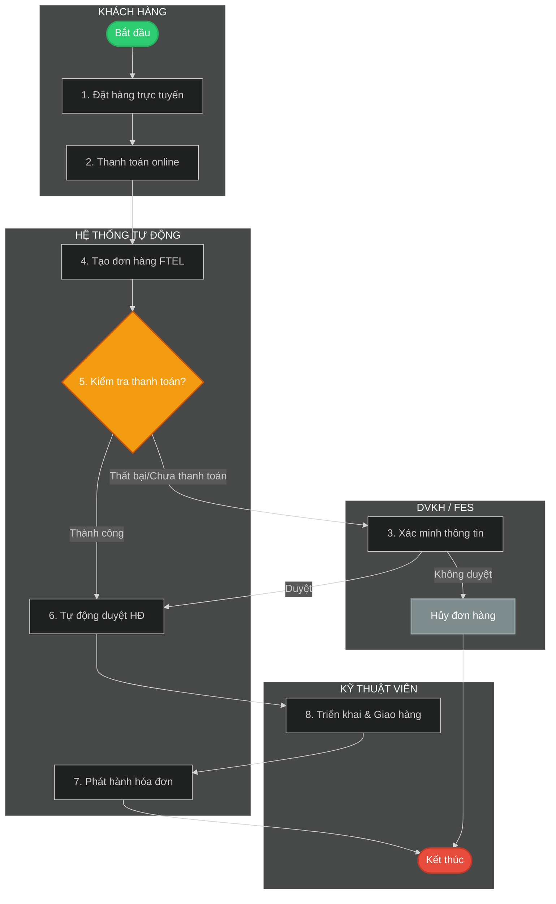

# Template: Flow Diagram Nghiệp Vụ Phân Làn (Swimlane Flowchart) Cho BA

Tài liệu này cung cấp template mẫu và hướng dẫn chi tiết giúp Business Analyst (BA) phân tích quy trình nghiệp vụ liên phòng ban và trực quan hóa thành **Flow Diagram phân làn (Swimlane Flowchart)** bằng mã Mermaid.

---

## 1. Nguyên Tắc Phân Tích Nghiệp Vụ Phân Làn
Khi tiếp nhận một quy trình nghiệp vụ phức tạp (như bán hàng, duyệt hợp đồng, vận hành sản phẩm), BA cần thực hiện các bước sau trước khi vẽ:
1. **Xác định các Tác nhân tham gia (Swimlanes/Subgraphs)**: Ai hoặc Hệ thống nào chịu trách nhiệm cho các hành động? (Ví dụ: PO, MKT, Khách hàng, DVKH, Hệ thống, Kỹ thuật viên).
2. **Xác định Điểm khởi đầu (Start) và Kết thúc (End)**: Quy trình bắt đầu khi nào và kết thúc ở đâu?
3. **Liệt kê các bước tuần tự (Sequence of Steps)**: Hành động của tác nhân này kích hoạt hành động tiếp theo của tác nhân nào?
4. **Xác định Điểm quyết định (Decision Points - Hình thoi)**: Logic rẽ nhánh (Ví dụ: Đúng/Sai, Đồng ý/Từ chối, Có lỗi/Thành công).
5. **Xác định các bước Tự động hóa (Automation Nodes)**: Phân biệt rõ hành động thủ công của con người và hành động xử lý tự động của hệ thống.

---

## 2. Cấu Trúc Mã Mermaid Swimlane Flowchart
Trong Mermaid, chúng ta mô phỏng các làn (Swimlanes) bằng cách sử dụng các khối `subgraph` định hướng `direction TB` hoặc `direction LR`.

### Mã Mermaid Mẫu (Luồng Bán hàng Tiêu biểu):


---

## 3. Template Tài Liệu Trình Bày (Dành cho BA)
Khi viết tài liệu mô tả luồng nghiệp vụ trong thư mục `docs/` hoặc `diagrams/`, hãy sử dụng cấu trúc template Markdown sau:

````markdown
# Luồng Nghiệp Vụ: [TÊN QUY TRÌNH]

Mô tả ngắn gọn mục tiêu của quy trình nghiệp vụ này và các phòng ban liên quan.


## 1. Mã Nguồn Mermaid
```mermaid
%%{init: { 'theme': 'dark' } }%%
flowchart TB
    %% Viết mã Mermaid tại đây
```

## 2. Bảng Phân Tích Làn Nghiệp Vụ (Swimlanes)

| Làn (Vai trò) | Trách Nhiệm Chính | Hệ Thống Sử Dụng |
| :--- | :--- | :--- |
| **[Tên vai trò 1]** | Mô tả các công việc chính của vai trò này | Tên phần mềm/công cụ (Ví dụ: CRM, Inside) |
| **[Tên vai trò 2]** | Mô tả các công việc chính của vai trò này | Tên phần mềm/công cụ |
| **Hệ Thống** | Các bước xử lý tự động, đồng bộ dữ liệu | Hệ thống Core, API Gateways |

## 3. Giải Thích Luồng Nghiệp Vụ Step-by-Step

### Bước 1 - N: Khởi tạo và Thiết lập
- **Bước 1**: [Mô tả chi tiết bước 1]
- **Bước 2**: [Mô tả chi tiết bước 2]

### Bước N+1 - M: Xử lý và Phê duyệt
- **Bước 3**: [Mô tả logic quyết định, điều kiện rẽ nhánh]
- **Bước 4**: [Mô tả hành động của hệ thống khi có kết quả duyệt]

### Bước M+1: Hoàn tất và Đối soát
- **Bước 5**: [Mô tả quy trình bàn giao vật lý, ký biên bản bàn giao]
- **Bước 6**: [Mô tả đối soát tài chính, phát hành hóa đơn]
````

---

## 4. Các Style CSS Thường Dùng Cho Node (Đảm bảo Trực quan)
Để sơ đồ dễ nhìn, hãy định nghĩa các lớp style ở cuối mã Mermaid:
- **Node Start/End**: Sử dụng hình elip bo tròn `([Tên Node])` và tô màu xanh/đỏ.
- **Node Decision**: Sử dụng hình thoi `{Câu hỏi quyết định?}` và tô màu vàng/cam.
- **Node Process**: Sử dụng hình chữ nhật mặc định.
- **Style Syntax**:
  - `style NodeId fill:#colorCode,stroke:#borderColor,stroke-width:2px,color:#textColor`
