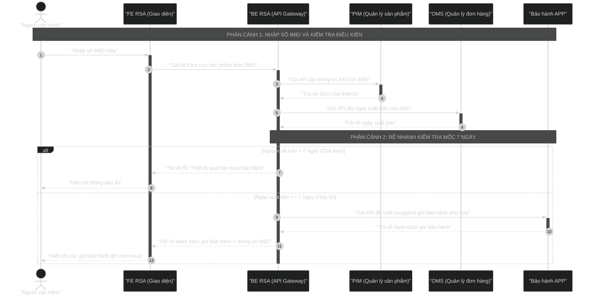

# Template: Sequence Diagram Tương Tác Hệ Thống Cho BA

Tài liệu này cung cấp template mẫu và hướng dẫn chi tiết giúp Business Analyst (BA) phân tích và trực quan hóa các tương tác giữa các hệ thống (API, Database, Microservices) thành **Sequence Diagram** bằng mã Mermaid.

---

## 1. Nguyên Tắc Phân Tích Tương Tác Hệ Thống
Trước khi vẽ sơ đồ trình tự, BA cần làm rõ các thành phần kỹ thuật tham gia thông qua các bước sau:
1. **Xác định các Đối tượng tham gia (Actors & Participants)**:
   - **Actor**: Con người hoặc hệ thống bên ngoài gọi vào (Ví dụ: Khách hàng, Đối tác giao hàng).
   - **FE (Front-end)**: Web Portal, Mobile App tương tác trực tiếp với Actor.
   - **BE (Back-end/API Gateway)**: Hệ thống trung gian tiếp nhận và điều phối request.
   - **Core Services/Microservices**: Các dịch vụ xử lý logic độc lập (Ví dụ: PIM, OMS, Bảo hành APP).
   - **Database/3rd Party**: Nơi lưu trữ dữ liệu hoặc dịch vụ của bên thứ ba.
2. **Xác định kiểu tương tác (Message Types)**:
   - **Gọi đồng bộ (`->>`)**: Client gửi request và PHẢI CHỜ server trả response mới làm tiếp.
   - **Gọi bất đồng bộ (`-)`)**: Client gửi tin nhắn/event rồi đi làm việc khác, không chờ phản hồi.
   - **Phản hồi (`-->>`)**: Trả kết quả của lệnh gọi đồng bộ trước đó.
3. **Quản lý Vòng đời & Kích hoạt (Activation - `+` và `-`)**:
   - Sử dụng `+` và `-` để thể hiện chính xác thời điểm một service đang tích cực xử lý request.
4. **Xác định các điều kiện logic (Fragments - `alt/else`, `opt`, `loop`)**:
   - Đặc biệt quan trọng đối với các luồng kiểm tra nghiệp vụ (Ví dụ: Kiểm tra hạn mức, thời gian, trạng thái đơn hàng).

---

## 2. Cấu Trúc Mã Mermaid Sequence Diagram Hướng Hệ Thống
Dưới đây là mã Mermaid mẫu dựa trên luồng kiểm tra bảo hành theo số IMEI của thiết bị:



---

## 3. Template Tài Liệu Trình Bày (Dành cho BA)
Khi tạo tài liệu cho Sequence Diagram, hãy sử dụng cấu trúc Markdown chuẩn dưới đây:

````markdown
# Sequence Diagram: [TÊN TƯƠNG TÁC HỆ THỐNG]

Mô tả ngắn gọn mục tiêu của luồng tương tác và các hệ thống tham gia.


## 1. Mã Nguồn Mermaid
```mermaid
%%{init: { 'theme': 'dark' } }%%
sequenceDiagram
    autonumber
    %% Viết mã Mermaid tại đây
```

## 2. Bảng Danh Sách Các API / Interface Mapping

| STT | API / Function | Hệ Thống Gửi | Hệ Thống Nhận | Kiểu Tương Tác | Mô Tả Dữ Liệu |
| :---: | :--- | :--- | :--- | :--- | :--- |
| **1** | `POST /api/v1/imei/search` | FE RSA | BE RSA | Đồng bộ (Sync) | Payload: `{ imei: "1234..." }` |
| **2** | `GET /pim/sku/by-imei` | BE RSA | PIM | Đồng bộ (Sync) | Response: `{ sku: "CAM-SE" }` |
| **3** | `GET /oms/sales-date` | BE RSA | OMS | Đồng bộ (Sync) | Response: `{ salesDate: "2026-06-01" }` |
| **4** | `POST /warranty/suggest` | BE RSA | Bảo hành APP | Đồng bộ (Sync) | Trả về danh sách gói bảo hành khả dụng |

## 3. Mô Tả Chi Tiết Logic Nghiệp Vụ & Quy Tắc Rẽ Nhánh
- **Quy tắc kiểm tra ngày xuất bán**:
  - Thời gian tính bằng: `Hiện tại - Ngày xuất bán`.
  - Nếu khoảng thời gian này lớn hơn 7 ngày, hệ thống chặn không cho phép mua thêm bảo hành để tránh gian lận sau khi sử dụng lâu.
- **Cơ chế gợi ý gói bảo hành**:
  - Gói bảo hành được lọc tự động dựa trên SKU thiết bị nhận được từ PIM. Ví dụ: SKU camera chỉ đề xuất các gói bảo hành camera tương ứng.
````

---

## 4. Bảng Ký Hiệu Mũi Tên Tương Tác Kỹ Thuật (Bản Rút Gọn)
- **`A->>+B`**: Gọi đồng bộ + Kích hoạt B (Hộp xử lý xuất hiện trên B).
- **`B-->>-A`**: Trả về dữ liệu + Hủy kích hoạt B.
- **`A-)B`**: Gọi bất đồng bộ (Ví dụ: ghi log, bắn message queue).
- **`A->>A`**: Xử lý logic nội bộ của hệ thống A.
