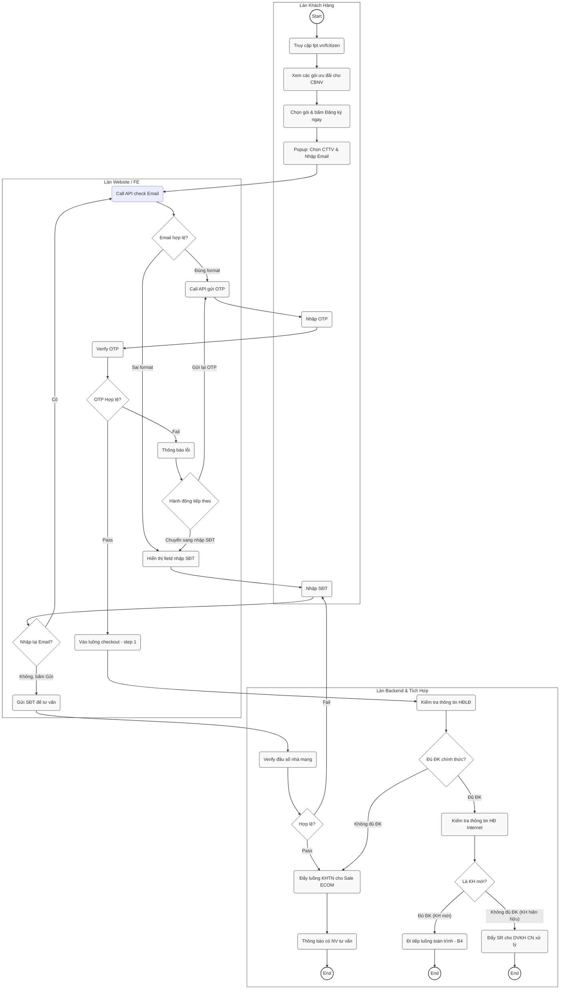

```mermaid
flowchart TD
    %% Define Styles
    classDef startEnd fill:#fff,stroke:#333,stroke-width:2px;
    classDef task fill:#f9f9f9,stroke:#333,stroke-width:1px,rx:5px,ry:5px;
    classDef gateway fill:#fff,stroke:#333,stroke-width:1px;
    classDef note fill:#fffacd,stroke:#d4c47b,stroke-width:1px,stroke-dasharray: 5 5;

    subgraph KH [Làn Khách Hàng]
        A((Start)):::startEnd --> B(Truy cập fpt.vn/fcitizen):::task
        B --> C(Xem các gói ưu đãi cho CBNV):::task
        C --> D(Chọn gói & bấm Đăng ký ngay):::task
        D --> E(Popup: Chọn CTTV & Nhập Email):::task
        
        H_input(Nhập OTP):::task
        I_input(Nhập SĐT):::task
    end

    subgraph FE [Làn Website / FE]
        E --> F(Call API check Email)
        F --> G{Email hợp lệ?}:::gateway
        
        G -- "Đúng format" --> H(Call API gửi OTP):::task
        G -- "Sai format" --> I(Hiển thị field nhập SĐT):::task
        
        H --> H_input
        
        I --> I_input
        I_input --> M{Nhập lại Email?}:::gateway
        M -- "Có" --> F
        M -- "Không, bấm Gửi" --> N(Gửi SĐT để tư vấn):::task
        
        H_input --> K(Verify OTP):::task
        K --> O{OTP Hợp lệ?}:::gateway
        
        O -- "Fail" --> Q(Thông báo lỗi):::task
        Q --> R{Hành động tiếp theo}:::gateway
        R -- "Gửi lại OTP" --> H
        R -- "Chuyển sang nhập SĐT" --> I
        
        O -- "Pass" --> P(Vào luồng checkout - step 1):::task
    end

    subgraph BE [Làn Backend & Tích Hợp]
        N --> S(Verify đầu số nhà mạng):::task
        S --> T{Hợp lệ?}:::gateway
        T -- "Pass" --> U(Đẩy luồng KHTN cho Sale ECOM):::task
        T -- "Fail" --> I_input
        
        U --> V(Thông báo có NV tư vấn):::task
        V --> W((End)):::startEnd
        
        P --> X(Kiểm tra thông tin HĐLĐ):::task
        X --> Y{Đủ ĐK chính thức?}:::gateway
        Y -- "Không đủ ĐK" --> U
        
        Y -- "Đủ ĐK" --> Z(Kiểm tra thông tin HĐ Internet):::task
        Z --> AA{Là KH mới?}:::gateway
        
        AA -- "Đủ ĐK (KH mới)" --> AB(Đi tiếp luồng toàn trình - B4):::task
        AA -- "Không đủ ĐK (KH hiện hữu)" --> AC(Đẩy SR cho DVKH CN xử lý):::task
        
        AB --> AD((End)):::startEnd
        AC --> AE((End)):::startEnd
    end
    
    %% Styling specifically for white background readability
    linkStyle default stroke:#333,stroke-width:1.5px;
    style KH fill:#ffffff,stroke:#333,stroke-width:1px
    style FE fill:#ffffff,stroke:#333,stroke-width:1px
    style BE fill:#ffffff,stroke:#333,stroke-width:1px
```
