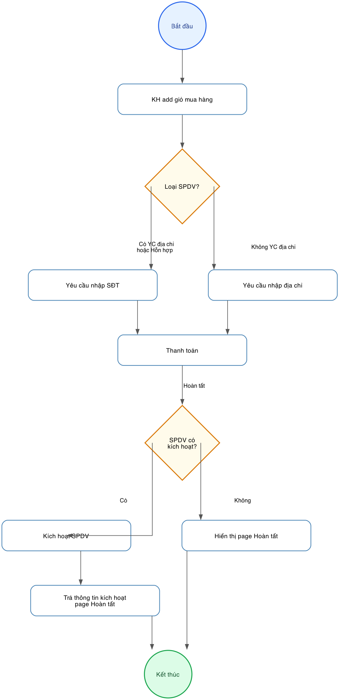
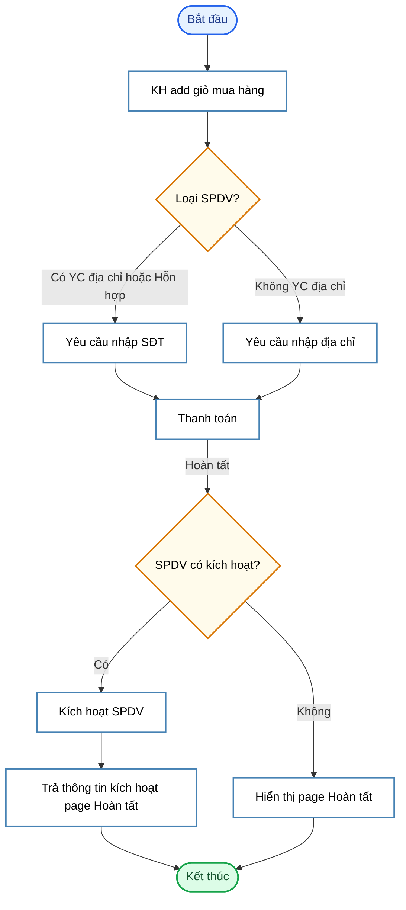

# Sơ đồ Luồng Giỏ Hàng (Mua SPDV)

Dưới đây là sơ đồ trực quan luồng khách hàng thêm sản phẩm vào giỏ hàng và thanh toán.

## 1. Mã Nguồn Mermaid

```mermaid
%%{init: { 'theme': 'default' } }%%
flowchart TB
    Start([Bắt đầu])
    AddCart[KH add giỏ mua hàng]
    CheckType{Loại SPDV?}
    ReqPhone[Yêu cầu nhập SĐT]
    ReqAddress[Yêu cầu nhập địa chỉ]
    Payment[Thanh toán]
    CheckAct{SPDV có kích hoạt?}
    Activate[Kích hoạt SPDV]
    ThanksAct[Trả thông tin kích hoạt page Hoàn tất]
    Thanks[Hiển thị page Hoàn tất]
    End([Kết thúc])

    Start --> AddCart
    AddCart --> CheckType
    
    CheckType -- "Có YC địa chỉ hoặc Hỗn hợp" --> ReqPhone
    CheckType -- "Không YC địa chỉ" --> ReqAddress
    
    ReqPhone --> Payment
    ReqAddress --> Payment
    
    Payment -- "Hoàn tất" --> CheckAct
    
    CheckAct -- "Có" --> Activate
    CheckAct -- "Không" --> Thanks
    
    Activate --> ThanksAct
    
    ThanksAct --> End
    Thanks --> End

    style Start fill:#E6F2FF,stroke:#2563EB,stroke-width:2px,color:#1E3A8A
    style End fill:#DCFCE7,stroke:#16A34A,stroke-width:2px,color:#14532D
    style CheckType fill:#FFFBEB,stroke:#D97706,stroke-width:2px,color:#000000
    style CheckAct fill:#FFFBEB,stroke:#D97706,stroke-width:2px,color:#000000
    style AddCart fill:#ffffff,stroke:#4682B4,stroke-width:2px,color:#000
    style ReqPhone fill:#ffffff,stroke:#4682B4,stroke-width:2px,color:#000
    style ReqAddress fill:#ffffff,stroke:#4682B4,stroke-width:2px,color:#000
    style Payment fill:#ffffff,stroke:#4682B4,stroke-width:2px,color:#000
    style Activate fill:#ffffff,stroke:#4682B4,stroke-width:2px,color:#000
    style Thanks fill:#ffffff,stroke:#4682B4,stroke-width:2px,color:#000
    style ThanksAct fill:#ffffff,stroke:#4682B4,stroke-width:2px,color:#000
```
