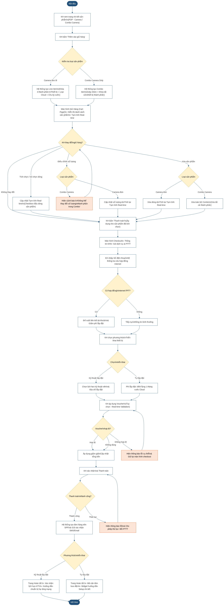

# Sơ đồ Flow Diagram: Luồng Giỏ Hàng & Checkout Camera FPT.vn

Sơ đồ thể hiện hành trình khách hàng (Customer Journey) từ khi chọn sản phẩm Camera trên trang chi tiết sản phẩm (PDP) đến khi hoàn tất đơn hàng, bao gồm toàn bộ các điểm quyết định và luồng xử lý ngoại lệ.

## Mã nguồn Mermaid

```mermaid
%%{init: {'theme': 'default', 'themeVariables': {'primaryColor': '#d9e1f2', 'primaryTextColor': '#1f4e78', 'primaryBorderColor': '#1f4e78', 'lineColor': '#1f4e78', 'background': '#ffffff', 'mainBkg': '#ffffff', 'nodeBorder': '#1f4e78', 'clusterBkg': '#f4f8ff', 'titleColor': '#1f4e78', 'edgeLabelBackground': '#ffffff', 'fontSize': '14px'}}}%%
flowchart TD
    A([Bắt đầu]) --> B

    B["KH xem trang chi tiết sản phẩm\n(PDP - Camera / Combo Camera)"]
    B --> C["KH bấm 'Thêm vào giỏ hàng'"]
    C --> D{Kiểm tra loại sản phẩm}

    D -->|Camera đơn lẻ| E["Hệ thống tạo Line Item\n(Khóa 3 thành phần:\nThiết bị + Loại Cloud + Chu kỳ cước)"]
    D -->|Combo Camera Only| F["Hệ thống tạo Combo Item\n(Gộp nhóm + Khóa tất cả\nthiết bị thành phần)"]

    E --> G
    F --> G

    G["Màn hình Giỏ Hàng (Cart Page)\n- Hiển thị danh sách sản phẩm\n- Tạm tính Real-time"]

    G --> H{KH thay đổi\ngiỏ hàng?}

    H -->|Tích chọn / bỏ chọn dòng| I["Cập nhật Tạm tính Real-time\n(Checkbox đầu dòng sản phẩm)"]
    H -->|Điều chỉnh số lượng| J{Loại sản phẩm}
    H -->|Xóa sản phẩm| K{Loại sản phẩm}
    H -->|Không thay đổi| L

    J -->|Camera đơn| J1["Cập nhật số lượng &\nTính lại Tạm tính Real-time"]
    J -->|Combo Camera| J2["Hiện cảnh báo:\n'Không thể thay đổi số lượng\nthành phần trong Combo'"]

    K -->|Camera đơn| K1["Xóa dòng &\nTính lại Tạm tính Real-time"]
    K -->|Combo Camera| K2["Xóa toàn bộ Combo\n(Xóa tất cả thành phần)"]

    I --> L
    J1 --> L
    J2 --> H
    K1 --> L
    K2 --> L

    L["KH bấm 'Thanh toán'\n(Áp dụng cho sản phẩm đã tích chọn)"]
    L --> M["Màn hình Checkout\n- Thông tin KH\n- Gói dịch vụ & PTTT"]

    M --> N["KH nhập Số điện thoại\nHệ thống tra cứu hợp đồng Internet"]
    N --> O{Có hợp đồng\nInternet FPT?}

    O -->|Có| P["Đề xuất liên kết tài khoản\n& Giảm phí lắp đặt"]
    O -->|Không| Q["Tiếp tục\nthông tin bình thường"]

    P --> R
    Q --> R

    R["KH chọn phương thức\nTriển khai thiết bị"]
    R --> S{Chọn\ntriển khai}

    S -->|Kỹ thuật lắp đặt| T["Chọn lịch hẹn kỹ thuật viên\n& Địa chỉ lắp đặt"]
    S -->|Tự lắp đặt| U["Phí lắp đặt: 0đ\nTặng 1 tháng cước Cloud"]

    T --> V
    U --> V

    V["KH áp dụng Voucher\n(Tùy chọn - Real-time Validation)"]
    V --> W{Voucher\nhợp lệ?}

    W -->|Hợp lệ| X["Áp dụng giảm giá\nCập nhật tổng tiền"]
    W -->|Không hợp lệ| Y["Hiện thông báo lỗi cụ thể\n& Giữ lại màn hình checkout"]
    W -->|Không dùng| X

    Y --> V
    X --> Z["KH xác nhận\n& Thanh toán"]

    Z --> AA{Thanh toán\nthành công?}

    AA -->|Thành công| AB["Hệ thống tạo đơn hàng trên SPF\n& Gửi xác nhận SMS/Email"]
    AA -->|Thất bại| AC["Hiện thông báo lỗi\n& Cho phép thử lại / đổi PTTT"]

    AC --> Z

    AB --> AD{Phương thức\ntriển khai}

    AD -->|Kỹ thuật lắp đặt| AE["Trang Hoàn tất:\n- Xác nhận lịch hẹn KTV\n- Hướng dẫn chuẩn bị hạ tầng mạng"]
    AD -->|Tự lắp đặt| AF["Trang Hoàn tất:\n- Mã vận đơn bưu điện\n- Widget hướng dẫn Setup chi tiết"]

    AE --> AG([Kết thúc])
    AF --> AG

    style A fill:#1f4e78,stroke:#1f4e78,color:#ffffff
    style AG fill:#1f4e78,stroke:#1f4e78,color:#ffffff
    style D fill:#fff2cc,stroke:#d6b656,color:#000000
    style H fill:#fff2cc,stroke:#d6b656,color:#000000
    style J fill:#fff2cc,stroke:#d6b656,color:#000000
    style K fill:#fff2cc,stroke:#d6b656,color:#000000
    style O fill:#fff2cc,stroke:#d6b656,color:#000000
    style S fill:#fff2cc,stroke:#d6b656,color:#000000
    style W fill:#fff2cc,stroke:#d6b656,color:#000000
    style AA fill:#fff2cc,stroke:#d6b656,color:#000000
    style AD fill:#fff2cc,stroke:#d6b656,color:#000000
    style Y fill:#fce4d6,stroke:#e36122,color:#000000
    style AC fill:#fce4d6,stroke:#e36122,color:#000000
    style J2 fill:#fce4d6,stroke:#e36122,color:#000000
```

## Giải thích luồng nghiệp vụ

### 1. Thêm vào giỏ hàng
- Camera đơn lẻ → tạo Line Item với khóa 3 thành phần
- Combo Camera Only → Gộp nhóm và khóa tất cả thành phần con

### 2. Tương tác giỏ hàng
- Tick/Untick dòng sản phẩm → Tạm tính cập nhật Real-time
- Điều chỉnh số lượng Combo → Báo lỗi (không cho phép)
- Xóa Combo → Xóa toàn bộ thành phần

### 3. Checkout
- Tra cứu hợp đồng Internet → Đề xuất liên kết & ưu đãi
- Chọn triển khai: KTV lắp / Tự lắp
- Voucher: Validation Real-time, lỗi cụ thể theo loại điều kiện

### 4. Hoàn tất
- Tự lắp → Mã vận đơn + hướng dẫn setup
- KTV lắp → Xác nhận lịch hẹn + hướng dẫn hạ tầng
