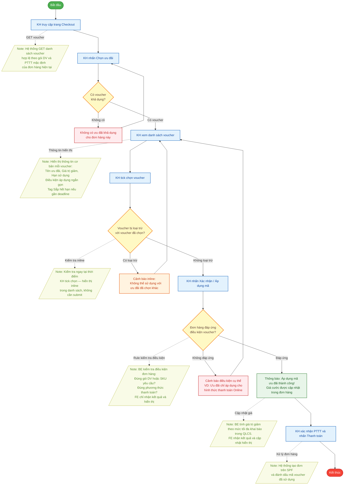

# Sơ đồ Flow Diagram: Hành Trình Khách Hàng — Áp Dụng Voucher FPT.vn (Phase 1)

Sơ đồ mô tả trải nghiệm của **Khách hàng** khi áp dụng voucher ưu đãi trong luồng Checkout trên FPT.vn.

**Ký hiệu:**
- 🔵 Hình chữ nhật xanh dương → Hành động của Khách hàng
- 🟡 Hình thoi vàng → Điểm quyết định / rẽ nhánh
- 🟨 Hình bình hành vàng lá (nét đứt) → Note hệ thống — quy tắc vận hành ẩn
- 🔴 Hình chữ nhật đỏ → Thông báo lỗi / cảnh báo KH thấy
- 🟢 Hình chữ nhật xanh lá → Thông báo thành công KH thấy

## Mã nguồn Mermaid (Dùng để render ảnh)

## Bảng Hành Trình Khách Hàng (Customer Journey)

| # | Hành Động KH | KH Thấy Gì | Hệ Thống Xử Lý Ngầm |
|:---:|:---|:---|:---|
| 1 | Truy cập trang Checkout | Trang Checkout với nút "Chọn ưu đãi" | GET danh sách voucher hợp lệ theo gói DV, PTTT mặc định |
| 2 | Nhấn "Chọn ưu đãi" | Popup danh sách voucher / Empty state nếu không có | Lọc và sắp xếp danh sách voucher |
| 3 | Xem danh sách voucher | Tên, giá trị giảm, hạn dùng, điều kiện ngắn, tag "Sắp hết hạn" | — |
| 4 | Tick chọn voucher | Cảnh báo inline nếu voucher bị loại trừ nhau | Kiểm tra xung đột tức thì (real-time) |
| 5 | Nhấn "Xác nhận / Áp dụng" | Thành công hoặc cảnh báo điều kiện cụ thể | BE kiểm tra gói DV, SKU, PTTT |
| 6 | Nhấn "Thanh toán" | Trang xác nhận đơn hàng thành công | Tạo đơn SPF, đánh dấu mã đã dùng |

## Giải Thích Chi Tiết Các Trường Hợp (Cases)

### Case 1: Không có voucher khả dụng
Khi KH nhấn "Chọn ưu đãi" mà hệ thống không trả về voucher nào phù hợp với thông tin checkout hiện tại → Hiển thị **empty state** với nội dung: *"Không có ưu đãi khả dụng cho đơn hàng này"*. KH có thể nhập mã thủ công nếu có.

### Case 2: Voucher không áp dụng đồng thời (Loại trừ nhau)
Được kiểm tra **ngay khi KH tick chọn** voucher trong danh sách (không cần nhấn Xác nhận):
- Nếu Voucher A đang được chọn và Voucher B không được dùng đồng thời → Hiển thị **cảnh báo inline** ngay tại dòng Voucher B: *"Không thể sử dụng với ưu đãi đã chọn khác"*
- KH có thể bỏ chọn Voucher A để chọn Voucher B, hoặc giữ nguyên lựa chọn cũ

### Case 3: Voucher không đáp ứng điều kiện đơn hàng
Sau khi KH nhấn "Xác nhận", BE kiểm tra và trả về lỗi điều kiện **cụ thể**:
- Sai phương thức thanh toán → *"Ưu đãi chỉ áp dụng cho hình thức thanh toán Online"*
- Sai gói cước / SKU → *"Ưu đãi không áp dụng cho gói dịch vụ đang chọn"*
- KH có thể thay đổi điều kiện đơn hoặc chọn voucher khác
