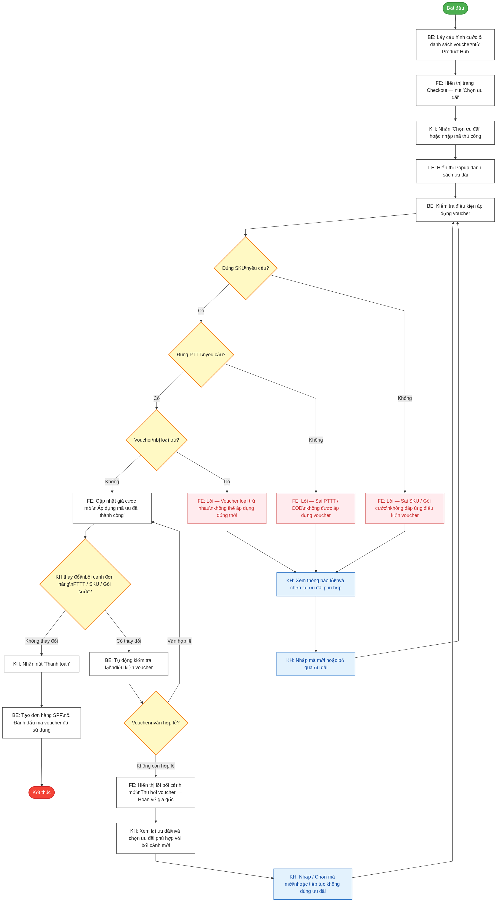
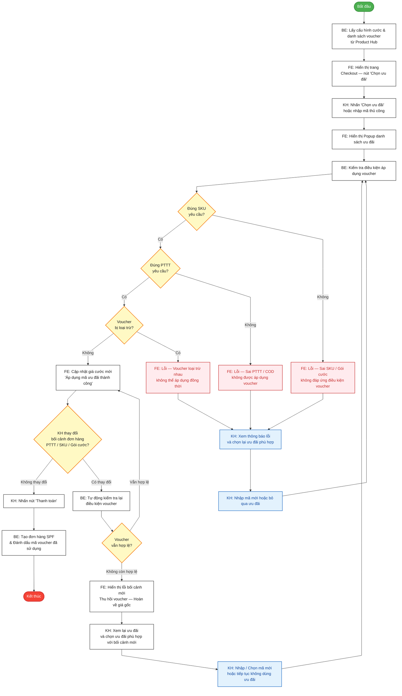

# Sơ đồ Flow Diagram: Luồng Nghiệp Vụ Áp Dụng Voucher FPT.vn (Phase 1)

Dưới đây là sơ đồ luồng hoạt động (Flow Diagram) thể hiện các bước rẽ nhánh và kiểm tra điều kiện áp dụng Voucher trên hệ thống FPT.vn.

## Mã nguồn Mermaid (Dùng để render ảnh)

