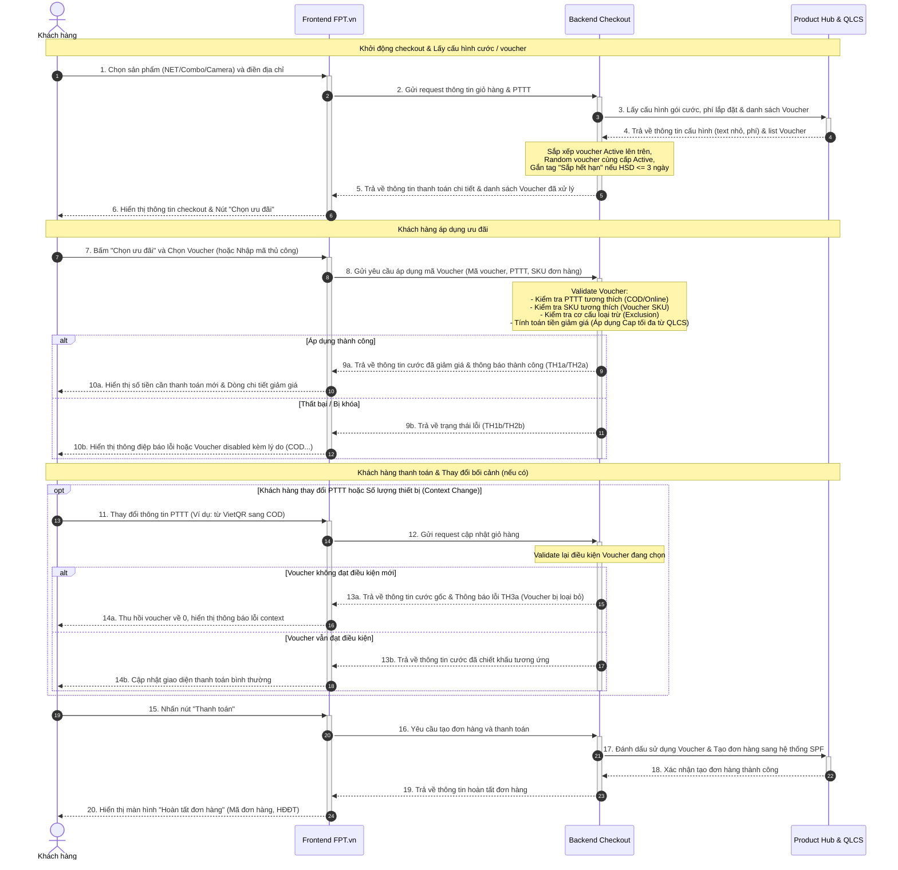

# Sơ đồ Sequence Diagram: Luồng Áp Dụng Voucher FPT.vn (Phase 1)

Dưới đây là sơ đồ trình tự tương tác giữa Khách hàng, Frontend FPT.vn, Backend Checkout và Product Hub / QLCS trong quá trình áp dụng voucher và thanh toán.

## Mã nguồn Mermaid (Dùng để render ảnh)

