# Sơ đồ Flow Diagram: Hành Trình Khách Hàng — Áp Dụng Voucher FPT.vn (Phase 1)

Sơ đồ mô tả trải nghiệm của **Khách hàng** khi áp dụng voucher ưu đãi trong luồng Checkout FPT.vn.
- **Hình chữ nhật xanh dương**: Hành động của Khách hàng
- **Hình thoi vàng**: Điểm quyết định / rẽ nhánh
- **Hình bình hành vàng lá (nét đứt)**: Note hệ thống — quy tắc vận hành ẩn phía sau
- **Hình chữ nhật đỏ**: Thông báo lỗi KH nhìn thấy
- **Hình chữ nhật xanh lá**: Thông báo thành công KH nhìn thấy

## Mã nguồn Mermaid (Dùng để render ảnh)

```mermaid
%%{init: { 'theme': 'default', 'flowchart': { 'curve': 'linear', 'nodeSpacing': 45, 'rankSpacing': 60 } } }%%
flowchart TD

    classDef startEnd fill:#4CAF50,stroke:#388E3C,stroke-width:2px,color:#fff
    classDef stopEnd  fill:#F44336,stroke:#D32F2F,stroke-width:2px,color:#fff
    classDef khStep   fill:#E3F2FD,stroke:#1565C0,stroke-width:1.5px,color:#0D47A1
    classDef gate     fill:#FFF9C4,stroke:#F57F17,stroke-width:2px,color:#5D4037
    classDef noteBox  fill:#F9FBE7,stroke:#AFB42B,stroke-width:1px,color:#558B2F
    classDef errBox   fill:#FFEBEE,stroke:#C62828,stroke-width:1.5px,color:#C62828
    classDef okBox    fill:#E8F5E9,stroke:#2E7D32,stroke-width:1.5px,color:#1B5E20

    START([Bắt đầu])

    S1["KH truy cập trang Checkout"]
    N1[/"Note hệ thống: Tự động tải cấu hình gói cước,
    thiết bị, PTTT & danh sách voucher từ Product Hub"/]

    S2["KH nhấn nút Chọn ưu đãi"]

    S3["KH xem Popup danh sách ưu đãi"]
    N3[/"Note hệ thống: Sắp xếp ưu tiên —
    Còn hạn trước, Sắp hết hạn gắn tag cảnh báo,
    Hết hạn hoặc không đủ điều kiện bị ẩn hoặc mờ"/]

    S4["KH chọn voucher từ danh sách
    hoặc nhập mã thủ công"]

    CHK{"Voucher
    hợp lệ?"}
    N4[/"Note hệ thống: BE kiểm tra đồng thời —
    Đúng SKU hoặc gói cước yêu cầu?
    Đúng phương thức thanh toán?
    Có bị loại trừ bởi voucher đang dùng?"/]

    ERR["Thông báo: Mã ưu đãi không hợp lệ.
    Vui lòng kiểm tra lại."]
    N_ERR[/"Note hệ thống: Lý do lỗi thường gặp —
    Voucher NET chỉ dùng thanh toán Online (không COD)
    Voucher SKU sai gói hoặc thiết bị đi kèm
    Hai voucher đang xung đột loại trừ nhau"/]

    OK["Thông báo: Áp dụng mã ưu đãi thành công!
    Giá cước đã được cập nhật"]
    N_OK[/"Note hệ thống: BE tính toán giá trị giảm,
    áp dụng mức giảm tối đa nếu được khai báo trong QLCS.
    FE chỉ nhận kết quả và hiển thị"/]

    CHG{"KH thay đổi
    thông tin đơn?"}
    N_CHG[/"Note hệ thống: Các thay đổi ảnh hưởng voucher —
    Đổi phương thức thanh toán, đổi gói cước hoặc SKU"/]

    PAY["KH nhấn nút Thanh toán"]

    RECHK{"Voucher
    vẫn hợp lệ?"}
    N_RECHK[/"Note hệ thống: Hệ thống tự động
    kiểm tra lại ngay khi KH thay đổi
    bất kỳ thông tin nào ảnh hưởng đến điều kiện voucher"/]

    REVOKE["Thông báo: Ưu đãi không còn phù hợp
    với thông tin đơn hàng mới.
    Voucher bị thu hồi — Giá cước hoàn về mức gốc."]

    N_PAY[/"Note hệ thống: Tạo đơn hàng trên SPF
    và đánh dấu mã voucher đã sử dụng"/]

    DONE([Kết thúc])

    class START startEnd
    class DONE stopEnd
    class S1,S2,S3,S4,PAY khStep
    class CHK,CHG,RECHK gate
    class N1,N3,N4,N_ERR,N_OK,N_CHG,N_RECHK,N_PAY noteBox
    class ERR,REVOKE errBox
    class OK okBox

    START --> S1
    S1 -. "Tải ngầm" .-> N1
    S1 --> S2 --> S3
    S3 -. "Quy tắc hiển thị" .-> N3
    S3 --> S4

    S4 --> CHK
    CHK -. "Rule kiểm tra" .-> N4

    CHK -->|Không hợp lệ| ERR
    ERR -. "Lý do" .-> N_ERR
    ERR --> S4

    CHK -->|Hợp lệ| OK
    OK -. "Cập nhật giá" .-> N_OK

    OK --> CHG
    CHG -. "Điều kiện bị ảnh hưởng" .-> N_CHG

    CHG -->|Không thay đổi| PAY
    CHG -->|Có thay đổi| RECHK

    RECHK -. "Auto re-validate" .-> N_RECHK
    RECHK -->|Vẫn hợp lệ| OK
    RECHK -->|Không còn hợp lệ| REVOKE
    REVOKE --> S4

    PAY -. "Xử lý đơn hàng" .-> N_PAY
    PAY --> DONE
```

## Bảng Phân Tích Hành Trình Khách Hàng

| # | Hành Động Khách Hàng | Hệ Thống Xử Lý Ngầm | KH Thấy Gì |
|:---:|:---|:---|:---|
| 1 | Truy cập trang Checkout | Tải cấu hình cước, thiết bị, PTTT và danh sách voucher từ Product Hub | Trang Checkout với nút "Chọn ưu đãi" |
| 2 | Nhấn "Chọn ưu đãi" | Mở Popup danh sách voucher đã lọc | Popup với danh sách ưu đãi |
| 3 | Xem danh sách voucher | Sắp xếp: Còn hạn → Sắp hết hạn (tag) → Hết hạn/Không đủ điều kiện | Danh sách voucher theo thứ tự ưu tiên |
| 4 | Chọn voucher / Nhập mã | BE kiểm tra SKU, PTTT, loại trừ | Thông báo thành công hoặc lỗi kèm lý do |
| 5 | Thay đổi gói cước / PTTT | Hệ thống tự động re-validate voucher đang áp dụng | Voucher vẫn giữ hoặc bị thu hồi kèm thông báo |
| 6 | Nhấn "Thanh toán" | Tạo đơn SPF, đánh dấu mã đã dùng | Trang xác nhận đơn hàng thành công |

## Giải Thích Luồng Nghiệp Vụ

### Bước 1–2: Khởi tạo & Vào Trang Checkout
KH truy cập trang Checkout. **Hệ thống tự động tải ngầm** toàn bộ cấu hình từ Product Hub (gói cước, thiết bị, PTTT khả dụng, danh sách voucher phù hợp). KH không thấy quá trình này — chỉ thấy trang Checkout sẵn sàng với nút "Chọn ưu đãi".

### Bước 3: Xem Popup Ưu Đãi
Popup hiển thị danh sách voucher được sắp xếp theo thứ tự ưu tiên tự động:
1. Voucher còn hiệu lực đầy đủ
2. Voucher sắp hết hạn — hệ thống **tự động gắn tag "Sắp hết hạn"** dựa trên ngưỡng ngày được cấu hình từ QLCS
3. Voucher hết hạn hoặc không đủ điều kiện — ẩn hoặc hiển thị mờ

### Bước 4: Chọn / Nhập Mã Voucher
KH chọn từ danh sách hoặc nhập mã thủ công. **BE tự động kiểm tra 3 điều kiện** song song:
- **SKU**: Gói cước / thiết bị trong đơn có khớp yêu cầu voucher không?
- **PTTT**: Voucher NET yêu cầu thanh toán Online (từ chối COD)
- **Loại trừ**: Không thể áp dụng đồng thời hai voucher xung đột

FE chỉ nhận kết quả từ BE và hiển thị thông báo tương ứng.

### Bước 5: Thay Đổi Bối Cảnh Đơn Hàng
Nếu KH điều chỉnh PTTT, gói cước hoặc thiết bị **sau khi đã áp mã** → Hệ thống **tự động kiểm tra lại** điều kiện voucher mà không cần KH thao tác. Nếu không còn hợp lệ → Thu hồi tự động, thông báo rõ lý do, hoàn về giá gốc → KH có thể chọn ưu đãi mới.

### Bước 6: Thanh Toán
KH nhấn "Thanh toán" → Hệ thống tạo đơn SPF và **đánh dấu mã đã sử dụng** để ngăn tái sử dụng.
