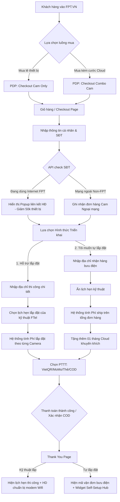
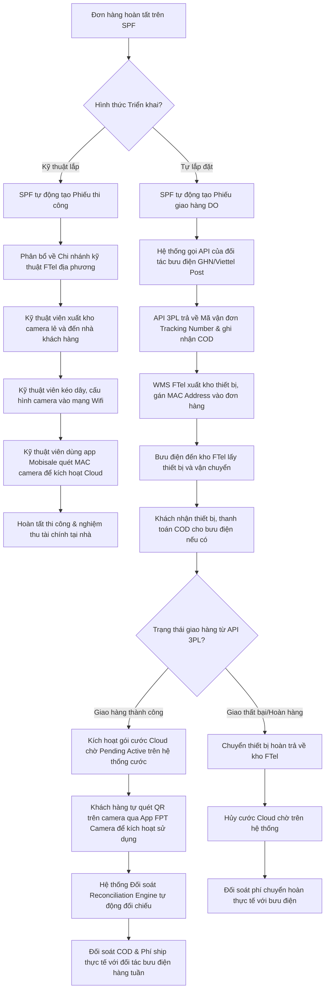

# USER REQUIREMENTS DOCUMENT (URD) - TÀI LIỆU YÊU CẦU NGƯỜI DÙNG

**Dự án:** FPT Camera E-Commerce System  
**Mã hiệu:** FPT-URD-CAM-SHIP-01  
**Phiên bản:** 1.0  
**Tác giả:** Senior Business Analyst / Product Owner  
**Ngày lập:** 05/06/2026  

---

## REVISION HISTORY (LỊCH SỬ THAY ĐỔI)
*Ký hiệu hành động: [A]: Add – Thêm mới | [U]: Update – Cập nhật, thay đổi | [D]: Delete - Xóa*

| Date | Version | Author | Action | Change Description |
| :--- | :--- | :--- | :---: | :--- |
| 05/06/2026 | 1.0 | Senior BA / PO | [A] | Khởi tạo tài liệu URD đặc tả chi tiết 2 luồng checkout (Cam Only và Combo Cam Only) cùng luồng xử lý giao hàng (Hỗ trợ lắp đặt vs Tự lắp đặt tích hợp 3PL & đối soát tài chính). |

---

## MỤC LỤC
* [A. GIỚI THIỆU](#a-giới-thiệu)
  * [1. Mục đích tài liệu](#1-mục-dịch-tài-liệu)
  * [2. Thông tin chung (Bối cảnh AS-IS - TO-BE)](#2-thông-tin-chung)
  * [3. Thuật ngữ và viết tắt](#3-thuật-ngữ-và-viết-tắt)
* [B. TỔNG QUAN HỆ THỐNG](#b-tổng-quan-hệ-thống)
  * [1. Sơ đồ luồng nghiệp vụ tổng quan (Workflows)](#1-sơ-đồ-luồng-nghiệp-vụ-tổng-quan)
  * [2. Danh sách các chức năng (Functional List)](#2-danh-sách-các-chức-năng)
  * [3. Ma trận quyền (Permission Matrix)](#3-ma-trận-quyền)
* [C. ĐẶC TẢ CHI TIẾT CÁC CHỨC NĂNG](#c-đặc-tả-chi-tiết-các-chức-năng)
  * [I. Luồng 1: Luồng Checkout Camera Only (Mua lẻ thiết bị)](#i-luồng-1-luồng-checkout-camera-only)
  * [II. Luồng 2: Luồng Checkout Combo Camera Only (Thiết bị + Cloud)](#ii-luồng-2-luồng-checkout-combo-camera-only)
  * [III. Luồng Giao hàng Camera & Xử lý Hậu kỳ (FTel Lắp đặt vs Tự lắp đặt)](#iii-luồng-giao-hàng-camera--xử-lý-hậu-kỳ)
  * [IV. Quy tắc Nghiệp vụ Chung (Business Rules)](#iv-quy-tắc-nghiệp-vụ-chung)
  * [V. Mô tả Giao diện & Ràng buộc Trường (Screen Description)](#v-mô-tả-giao-diện--ràng-buộc-trường)
  * [VI. Kịch bản lỗi & Thông báo hiển thị (Error Messages)](#vi-kịch-bản-lỗi--thông-báo-hiển-thị)
* [D. YÊU CẦU PHI CHỨC NĂNG](#d-yêu-cầu-phi-chức-năng)
  * [1. Hiệu năng hệ thống (Performance)](#1-hiệu-năng-hệ-thống)
  * [2. Bảo mật & An toàn thông tin (Security)](#2-bảo-mật--an-toàn-thông-tin)
  * [3. Trải nghiệm người dùng & Giao diện (UI/UX)](#3-trải-nghiệm-người-dùng--giao-diện)
* [E. PHỤ LỤC & TÀI LIỆU THAM KHẢO](#e-phụ-lục--tài-liệu-tham-khảo)

---

## A. GIỚI THIỆU

### 1. Mục đích tài liệu
Tài liệu này đặc tả chi tiết yêu cầu người dùng (URD) nhằm xây dựng và tối ưu hóa hai luồng mua hàng và giao vận trực tuyến đối với dòng sản phẩm FPT Camera:
- **Luồng 1 - Checkout Camera Only (Mua lẻ thiết bị)**: Khách hàng chỉ có nhu cầu mua phần cứng Camera độc lập.
- **Luồng 2 - Checkout Combo Camera Only (Combo Camera + Cloud)**: Khách hàng mua trọn gói combo bao gồm phần cứng Camera và dịch vụ lưu trữ đám mây Cloud Storage (không đi kèm đường truyền mạng Internet FPT).
- **Luồng Giao hàng Hậu kỳ**: Phân tích chi tiết quy trình xử lý đơn hàng giữa hai phương thức triển khai: **Hỗ trợ lắp đặt** (kỹ thuật viên FTel thi công trực tiếp và tính phí riêng theo từng camera) và **Tự lắp đặt** (giao hàng qua bưu điện/đối tác vận chuyển 3PL, tính phí giao vận trên tổng đơn hàng, tự động hóa luồng tạo phiếu giao, lấy mã vận đơn và đối soát tài chính).

Tài liệu này là căn cứ duy nhất để đội ngũ thiết kế UI/UX xây dựng giao diện, đội ngũ phát triển (Frontend/Backend) xây dựng logic hệ thống, và đội ngũ kiểm thử (QC) nghiệm thu tính năng trước khi đưa sản phẩm vào hoạt động chính thức trên website fpt.vn.

### 2. Thông tin chung
| STT | HẠNG MỤC | MÔ TẢ CHI TIẾT |
| :---: | :--- | :--- |
| 1 | **Giới thiệu tổng quan** | Hệ thống hỗ trợ khách hàng mua sắm FPT Camera trực tuyến một cách dễ dàng và linh hoạt. Khách hàng sử dụng mạng của bất kỳ nhà cung cấp nào (FPT, Viettel, VNPT, v.v.) đều có thể đặt hàng. Hệ thống mở rộng thêm khả năng chọn hình thức tự lắp đặt giúp giảm chi phí đầu tư ban đầu của khách hàng và tăng tốc độ giao vận thiết bị thông qua hệ thống tích hợp API bưu điện tự động. |
| 2 | **Hiện trạng hệ thống (AS-IS)**| 1. Khách hàng ngoại mạng khó tiếp cận hệ thống do quy trình cũ bắt buộc phải có hợp đồng Internet FPT hoặc mặc định xếp lịch kỹ thuật viên thi công tận nơi. 2. Chưa hỗ trợ hình thức **Tự lắp đặt** trực tuyến, dẫn đến việc tăng chi phí nhân công lắp đặt cho khách hàng và gây tải cho đội ngũ kỹ thuật FTel. 3. Phí lắp đặt được tính chung chung, chưa phân tách rõ ràng biểu phí lắp đặt cho từng camera so với phí giao vận bưu điện cho cả đơn hàng. 4. Luồng xử lý đơn bưu điện hậu kỳ còn thủ công, nhân viên phải xuất excel đơn hàng và khai báo thủ công trên portal bưu điện để lấy mã vận đơn, đối soát COD và phí ship bằng phương pháp đối chiếu file bán thủ công. |
| 3 | **Mục tiêu kỳ vọng (TO-BE)** | 1. Xây dựng luồng thanh toán một trang (One-page checkout) thông minh tối ưu cho cả luồng mua lẻ camera và combo camera. 2. Cung cấp tùy chọn **Tự lắp đặt** với ưu đãi tặng tháng cước Cloud và miễn phí vận chuyển/tính phí ship theo tổng đơn hàng. 3. Tích hợp tự động API 3PL (Giao Hàng Nhanh, Viettel Post...) để tự sinh phiếu giao hàng (DO), lấy mã vận đơn trực tiếp, cập nhật hành trình đơn hàng trên Thank You Page. 4. Xây dựng phân hệ đối soát tài chính (Reconciliation Engine) tự động đối chiếu số liệu COD và phí vận chuyển giữa FTel và đối tác bưu điện. |
| 4 | **Phạm vi triển khai** | **- Phạm vi kỹ thuật:** Web portal FPT.VN (Desktop/Mobile), hệ thống CRM/SPF quản lý đơn hàng, hệ thống WMS (Quản lý kho), API cổng thanh toán, API đối tác vận chuyển 3PL (GHN/Viettel Post), Hệ thống đối soát cước. **- Phạm vi nghiệp vụ:** Từ chọn cấu hình thiết bị/combo trên PDP -> Điền thông tin giao nhận/lắp đặt tại Checkout -> Tự động tính biểu phí lắp đặt/ship -> Thanh toán trực tuyến/COD -> Đẩy phiếu thi công kỹ thuật hoặc phiếu giao bưu điện -> Tích hợp API 3PL cập nhật trạng thái -> Đối soát API bưu điện và đối soát tài chính hậu kỳ. **- Phạm vi tổ chức:** Chi nhánh kinh doanh FTel, phòng dịch vụ khách hàng, đối tác vận chuyển thứ ba, đội kỹ thuật thi công và bộ phận tài chính kế toán đối soát. |

### 3. Thuật ngữ và viết tắt
| STT | THUẬT NGỮ | NGHĨA TIẾNG ANH / TÊN ĐẦY ĐỦ | MÔ TẢ Ý NGHĨA |
| :---: | :--- | :--- | :--- |
| 1 | URD | User Requirements Document | Tài liệu yêu cầu người dùng. |
| 2 | Cam Only | Camera Only | Khách hàng chỉ mua thiết bị phần cứng Camera lẻ, không kèm gói cước Cloud mới. |
| 3 | Combo Cam | Combo Camera | Khách hàng đăng ký mua combo gồm cả thiết bị Camera và gói lưu trữ Cloud mới. |
| 4 | 3PL | Third-Party Logistics | Đối tác vận chuyển thứ ba (Ví dụ: Giao Hàng Nhanh, Viettel Post, Giaohangtietkiem...). |
| 5 | SPF | Sales Processing Framework | Hệ thống xử lý đơn hàng cốt lõi của FPT Telecom. |
| 6 | DO | Delivery Order | Phiếu giao hàng được tạo tự động trên hệ thống để chuyển giao thiết bị. |
| 7 | COD | Cash On Delivery | Thanh toán bằng tiền mặt khi nhận thiết bị (tại nhà qua bưu điện hoặc qua kỹ thuật viên). |
| 8 | WMS | Warehouse Management System | Hệ thống quản lý kho hàng, xuất/nhập thiết bị theo MAC/Serial. |
| 9 | MAC Address | Media Access Control Address | Địa chỉ vật lý của thiết bị Camera dùng để gán cước Cloud và kích hoạt sản phẩm. |
| 10 | Reconciliation | Financial Reconciliation | Quy trình đối soát tài chính đối chiếu tiền thu hộ COD và phí vận chuyển giữa FTel và bưu điện. |

---

## B. TỔNG QUAN HỆ THỐNG

### 1. Sơ đồ luồng nghiệp vụ tổng quan (Workflows)

#### Sơ đồ 1: Luồng Checkout trực tuyến phía khách hàng (Frontend Customer Flow)

#### Sơ đồ 2: Luồng Hậu kỳ xử lý Giao hàng và Đối soát Tài chính (Backend Logistics & Financial Reconciliation Flow)

---

### 2. Danh sách các chức năng (Functional List)
| STT | Module / Chức năng | Version | Loại | Mô tả tóm tắt hành vi hệ thống |
| :---: | :--- | :---: | :---: | :--- |
| 1 | **Trang PDP - Cấu hình Camera lẻ** | 1.0 | New | Hỗ trợ chọn loại Camera (Indoor/Outdoor), số lượng và tùy chọn *"Tôi đã có gói Cloud"* để mua lẻ thiết bị mà không cần đăng ký Cloud mới. |
| 2 | **Trang PDP - Cấu hình Combo Camera** | 1.0 | New | Hỗ trợ đăng ký combo trọn gói gồm Thiết bị + Gói Cloud (3/7/14 ngày) + Chu kỳ (6/12 tháng). Tự động đồng bộ số lượng gói Cloud bằng số lượng thiết bị. |
| 3 | **Động cơ kiểm tra SĐT & Đề xuất** | 1.0 | New | Tra cứu không đồng bộ số điện thoại tại trang Checkout. Nếu có hợp đồng Internet FPT, đề xuất liên kết để giảm 50.000đ/thiết bị và gộp hóa đơn. |
| 4 | **Trang Checkout - Tùy chọn Triển khai** | 1.0 | New | Khách hàng chủ động chọn "Kỹ thuật lắp đặt" hoặc "Tự lắp đặt". Hệ thống tự động thay đổi cấu trúc điền địa chỉ, lịch hẹn và hiển thị ưu đãi tương ứng. |
| 5 | **Động cơ tính phí lắp đặt phân cấp** | 1.0 | New | Tự động tính phí lắp đặt theo từng camera (150k cho mạng ngoài, 110k cho mạng FPT) hoặc miễn phí khi tự lắp đặt hay mua gói Cloud trả trước 6/12 tháng. |
| 6 | **Động cơ tính phí giao hàng bưu điện** | 1.0 | New | Tự động tính phí ship theo tổng đơn hàng đối với hình thức tự lắp đặt. Phí giao hàng có thể cấu hình cố định (Flat rate) hoặc miễn phí theo giá trị đơn hàng. |
| 7 | **Tích hợp API đối tác vận chuyển 3PL**| 1.0 | New | Gọi API đẩy đơn sang GHN/Viettel Post để lấy mã vận đơn thời gian thực, đồng thời cập nhật trạng thái giao hàng để đồng bộ luồng kích hoạt cước. |
| 8 | **Trang cảm ơn tích hợp tự hướng dẫn** | 1.0 | New | Thank You Page hiển thị mã vận đơn bưu điện và tích hợp widget Self-Setup Hub (video 3D, kiểm tra tốc độ Wifi upload, các bước quét mã QR). |
| 9 | **Hệ thống Đối soát Tài chính Hậu kỳ**| 1.0 | New | Phân hệ tự động đối khớp tiền thu hộ COD và phí ship từ API đối tác giao vận với đơn hàng trên hệ thống SPF của FTel nhằm tự động hóa quy trình tài chính. |

---

### 3. Ma trận quyền (Permission Matrix)

#### Bảng Định nghĩa Quyền (Permission Definition List)
| Mã Quyền | Tên Quyền | Mô tả chi tiết hành vi |
| :---: | :--- | :--- |
| **F** | Full Access | Toàn quyền thao tác trên module (Xem, Cấu hình giá, Phí lắp đặt, Phí ship, Đối tác bưu điện trên CMS). |
| **A** | Add | Tạo mới đơn hàng, phiếu giao DO, phiếu thi công hoặc gửi yêu cầu API. |
| **V** | View | Xem thông tin chi tiết đơn hàng, mã vận đơn, hành trình giao nhận và kết quả đối soát. |
| **L** | List | Xem thông tin dưới dạng danh sách (danh sách đơn hàng, danh sách đối soát). |
| **E** | Export | Xuất file báo cáo đối soát tài chính, doanh thu (Excel, PDF...). |

#### Bảng Phân quyền Module (Permission Matrix Table)
| STT | Tên Chức năng / Module | Role Admin | Role Kỹ thuật / Kho | Role Bưu điện (API) | Role Khách hàng | Ghi chú |
| :---: | :--- | :---: | :---: | :---: | :---: | :--- |
| 1 | Cấu hình giá thiết bị, Cloud, phí ship | F | V | N/A | N/A | Chỉ Admin thực hiện |
| 2 | Đặt mua hàng & chọn hình thức | V, L | N/A | N/A | A, V | Khách hàng thực hiện checkout |
| 3 | Quản lý kho (WMS) & gán MAC camera | V, L | A, V, L | N/A | N/A | Thủ kho quét MAC khi xuất hàng |
| 4 | Tạo mã vận đơn & Cập nhật hành trình | V, L | V | A, V, L | V (Xem tracking) | Tích hợp qua API bưu điện |
| 5 | Đối soát công nợ & phí ship | F, E | N/A | V, L (Đẩy file) | N/A | Bộ phận tài chính thực hiện |

---

## C. ĐẶC TẢ CHI TIẾT CÁC CHỨC NĂNG

### I. Luồng 1: Luồng Checkout Camera Only (Mua lẻ thiết bị)
- **Tác nhân tham gia:** Khách hàng vãng lai, Khách hàng đã đăng nhập.
- **Điều kiện bắt đầu (Pre-conditions):** Khách hàng đang ở trang chi tiết sản phẩm (PDP) và chọn mua thiết bị Camera lẻ bằng cách tick chọn *"Tôi đã có gói Cloud (Chỉ mua thiết bị lẻ)"*, điều chỉnh số lượng và bấm nút *"Mua ngay"*.
- **Luồng xử lý chi tiết (Step-by-step):**
  - **Bước 1:** Khách hàng bấm *"Mua ngay"* trên PDP. Hệ thống lưu thiết bị vào giỏ hàng và điều hướng sang trang Checkout. Giá gói Cloud hiển thị trong giỏ hàng là `0đ`.
  - **Bước 2:** Khách hàng điền thông tin Họ tên và Số điện thoại. Hệ thống gọi API kiểm tra SĐT ngầm:
    - Nếu SĐT có hợp đồng Internet FPT: Hiển thị banner đề xuất liên kết hợp đồng để giảm trực tiếp 50.000đ/thiết bị vào đơn hàng.
    - Nếu SĐT dùng mạng ngoài: Ghi nhận là đơn hàng Camera Only ngoại mạng bình thường.
  - **Bước 3:** Khách hàng chọn hình thức triển khai lắp đặt:
    - **Tùy chọn A (Hỗ trợ lắp đặt):** Hệ thống yêu cầu điền địa chỉ chi tiết, hiển thị lịch chọn ngày kỹ thuật viên đến lắp đặt. Hệ thống tính phí lắp đặt theo từng camera (Ví dụ: Mua 2 camera mạng ngoài, phí lắp đặt = 2 x 150.000đ = 300.000đ).
    - **Tùy chọn B (Tôi muốn tự lắp đặt):** Hệ thống yêu cầu điền địa chỉ giao hàng. Ẩn lịch chọn ngày hẹn thi công. Hiển thị thông báo giao hàng miễn phí qua bưu điện. Phí lắp đặt chuyển về `0đ`.
  - **Bước 4:** Khách hàng chọn phương thức thanh toán (VietQR, MoMo, Thẻ quốc tế hoặc COD).
  - **Bước 5:** Khách hàng bấm nút *"Thanh toán"*. Sau khi giao dịch thành công (hoặc đơn hàng COD được hệ thống SPF xác nhận):
    - Đơn Kỹ thuật lắp: Sinh phiếu thi công gửi xuống chi nhánh FTel.
    - Đơn Tự lắp đặt: Sinh phiếu giao hàng DO, gọi API bưu điện lấy mã vận đơn, thủ kho xuất thiết bị, quét gán MAC Address vào hệ thống.
  - **Bước 6:** Hệ thống điều hướng khách hàng sang trang Thank You Page:
    - Nếu Kỹ thuật lắp: Hiển thị ngày thi công đã hẹn và lưu ý chuẩn bị Wifi.
    - Nếu Tự lắp đặt: Hiển thị mã vận đơn bưu điện kèm đường link theo dõi hành trình và widget Self-Setup Hub hướng dẫn tự kết nối camera.
- **Điều kiện kết thúc (Post-conditions):** Tạo đơn hàng thành công trên hệ thống SPF, gửi SMS/Email xác nhận thông tin đơn hàng và mã vận đơn cho khách hàng.

---

### II. Luồng 2: Luồng Checkout Combo Camera Only (Thiết bị + Cloud)
- **Tác nhân tham gia:** Khách hàng vãng lai, Khách hàng đã đăng nhập.
- **Điều kiện bắt đầu (Pre-conditions):** Khách hàng chọn cấu hình combo gồm thiết bị Camera + gói lưu trữ Cloud (3/7/14 ngày) + chu kỳ thanh toán (6/12 tháng) trên PDP và nhấn *"Mua ngay"*.
- **Luồng xử lý chi tiết (Step-by-step):**
  - **Bước 1:** Khách hàng bấm *"Mua ngay"*, hệ thống lưu thông tin combo (thiết bị và gói Cloud đi kèm) vào giỏ hàng và chuyển hướng sang trang Checkout. Số lượng gói Cloud đăng ký được khóa cứng và luôn bằng số lượng thiết bị phần cứng Camera.
  - **Bước 2:** Khách hàng điền thông tin Họ tên và Số điện thoại. Hệ thống gọi API kiểm tra SĐT để hiển thị thông tin gộp tài khoản Camera sẵn có hoặc thông báo tự động tạo tài khoản mới.
  - **Bước 3:** Khách hàng chọn hình thức triển khai lắp đặt:
    - **Tùy chọn A (Hỗ trợ lắp đặt):** Nhập địa chỉ thi công, chọn ngày hẹn thi công. Hệ thống tính phí lắp đặt theo từng camera.
      - *Quy tắc ưu đãi:* Nếu chu kỳ thanh toán Cloud là 6 hoặc 12 tháng, hệ thống tự động giảm phí lắp đặt về `0đ` (Miễn phí lắp đặt).
    - **Tùy chọn B (Tôi muốn tự lắp đặt):** Nhập địa chỉ giao hàng bưu điện. Hệ thống chuyển phí lắp đặt về `0đ`.
      - *Quy tắc ưu đãi tự lắp:* Hệ thống tự động kích hoạt chương trình tặng thêm 01 tháng cước Cloud miễn phí và hiển thị nhãn khuyến mãi trên Sidebar đơn hàng.
  - **Bước 4:** Khách hàng chọn phương thức thanh toán (VietQR, MoMo, Thẻ quốc tế hoặc COD).
  - **Bước 5:** Khách hàng xác nhận thanh toán thành công.
  - **Bước 6:** Điều hướng sang Thank You Page tương ứng (Hiện lịch hẹn kỹ thuật lắp đặt hoặc hiện mã vận đơn và widget hướng dẫn tự kích hoạt cước Cloud).
- **Điều kiện kết thúc (Post-conditions):** Tạo đơn hàng thành công, kích hoạt gói cước Cloud ở trạng thái chờ kích hoạt (Pending Active) cho đến khi thiết bị được kỹ thuật viên lắp đặt xong hoặc bưu điện giao hàng thành công.

---

### III. Luồng Giao hàng Camera & Xử lý Hậu kỳ (FTel Lắp đặt vs Tự lắp đặt)
Quy trình giao hàng và xử lý kỹ thuật/logistics hậu kỳ được phân tách chi tiết như sau:

#### 1. Phương án "Hỗ trợ lắp đặt" (Kỹ thuật viên FTel thi công)
- **Định nghĩa:** Khách hàng yêu cầu nhân viên kỹ thuật FPT Telecom đến địa chỉ nhà để thi công kéo cáp, cài đặt cấu hình camera.
- **Quy trình vận hành:**
  1. Hệ thống SPF tiếp nhận đơn hàng, tự động kiểm tra địa chỉ lắp đặt để gán đơn hàng về cho chi nhánh FTel gần nhất quản lý.
  2. Hệ thống tạo **Phiếu thi công lắp đặt** tự động, xếp lịch hẹn thi công theo ngày khách hàng chọn trên Checkout Page.
  3. Nhân viên kỹ thuật của chi nhánh nhận phiếu thi công qua ứng dụng nội bộ (Mobisale).
  4. Đến ngày hẹn, kỹ thuật viên đến kho chi nhánh lấy thiết bị Camera (quét barcode/Serial/MAC Address để xuất kho trên WMS chi nhánh).
  5. Kỹ thuật viên đến nhà khách hàng thực hiện thi công lắp đặt phần cứng lên tường/trần, kết nối nguồn điện và bắt Wifi nhà khách hàng.
  6. Sau khi kết nối thành công, kỹ thuật viên dùng app Mobisale quét mã MAC Address của thiết bị Camera để gửi yêu cầu kích hoạt lên hệ thống cước, tự động liên kết gói Cloud đã mua với thiết bị đó.
  7. Thu tiền mặt COD từ khách hàng (nếu chọn PTTT là COD) và đóng phiếu thi công hoàn thành.

#### 2. Phương án "Tôi muốn tự lắp đặt" (Giao hàng qua bưu điện/3PL)
- **Định nghĩa:** Khách hàng tự thi công lắp đặt tại nhà, FTel thực hiện đóng gói và vận chuyển thiết bị thông qua đơn vị chuyển phát nhanh độc lập (3PL).
- **Quy trình vận hành chi tiết:**
  1. Hệ thống SPF tiếp nhận đơn hàng, ghi nhận trạng thái triển khai là **Tự lắp đặt**.
  2. SPF tự động sinh **Phiếu giao hàng DO (Delivery Order)** và chuyển thông tin sang hệ thống Quản lý kho trung tâm (WMS).
  3. **Tích hợp API Đối tác vận chuyển (3PL):** Hệ thống WMS/SPF gọi API thời gian thực của đối tác giao vận (ví dụ: Giao Hàng Nhanh - GHN hoặc Viettel Post) để đẩy các thông tin đơn hàng:
     - Thông tin người gửi (FTel Warehouse).
     - Thông tin người nhận (Họ tên, SĐT, Địa chỉ chi tiết).
     - Kích thước đóng gói & Trọng lượng đơn hàng.
     - Số tiền thu hộ COD (Giá trị đơn hàng + Phí giao hàng - Tiền đã thanh toán trực tuyến).
  4. Đối tác 3PL tiếp nhận thông tin đơn hàng qua API, sinh và phản hồi lại cho hệ thống FTel **Mã vận đơn (Tracking Number)**.
  5. Hệ thống FTel cập nhật mã vận đơn này lên tài khoản khách hàng, hiển thị trên trang Thank You Page và tự động gửi SMS xác nhận cho khách hàng.
  6. Nhân viên kho WMS in phiếu giao hàng có chứa mã vận đơn bưu điện, thực hiện lấy thiết bị Camera trong kho, quét mã MAC Address của từng camera để gán cứng vào đơn hàng trên hệ thống, hoàn tất đóng gói.
  7. Shipper của đối tác bưu điện đến kho FTel lấy hàng đi giao.
  8. **Theo dõi hành trình qua API Webhook:** Đối tác 3PL gửi Webhook cập nhật trạng thái đơn hàng thời gian thực về hệ thống FTel (Đang vận chuyển -> Đang giao hàng -> Giao hàng thành công / Giao thất bại - Chờ hoàn hàng).
  9. **Kích hoạt cước Cloud tự động:** Khi nhận được webhook trạng thái **Giao hàng thành công (Delivered)**:
     - Hệ thống SPF chuyển đơn hàng sang trạng thái hoàn thành.
     - Hệ thống cước tự động chuyển gói Cloud đã mua kèm (nếu có) từ trạng thái chờ sang trạng thái chờ quét thiết bị (Pending Activation).
     - Khách hàng nhận được SMS thông báo: *"Đơn hàng của bạn đã giao thành công. Vui lòng mở ứng dụng FPT Camera, quét mã QR dưới đáy Camera để kích hoạt gói Cloud."*
  10. **Quy trình Đối soát Tài chính Hậu kỳ (Financial Reconciliation Engine):**
      - **Đối soát COD:** Đối tác bưu điện định kỳ 2 lần/tuần gửi file đối soát tài chính (bao gồm số tiền COD thu hộ thực tế đã nhận từ khách hàng). Hệ thống đối soát FTel tự động đối chiếu số tiền COD bưu điện báo cáo với số tiền COD ghi nhận trên đơn hàng SPF. Nếu khớp, tự động xác nhận hoàn thành công nợ. Nếu lệch (lệch tiền thu hộ, lệch trạng thái), đẩy đơn hàng sang tab *Lệch đối soát* để nhân viên tài chính xử lý thủ công.
      - **Đối soát Phí ship:** Hệ thống tự động tính toán phí ship lý thuyết dựa trên bảng phí đã cấu hình trên CMS (Phí ship tổng đơn hàng, ví dụ: 30.000đ/đơn, hoặc 0đ nếu đơn hàng trên 1.000.000đ). Phân hệ đối soát sẽ so sánh phí ship lý thuyết này với phí ship thực tế mà đối tác bưu điện tính tiền trong file đối soát (dựa trên trọng lượng và khoảng cách thực tế) để kiểm soát chi phí vận hành logistics.

---

## IV. Quy tắc Nghiệp vụ Chung (Business Rules)

| Mã Rule | Tên Quy tắc | Nội dung quy tắc chi tiết |
| :---: | :--- | :--- |
| **BR-CAM-01** | Kiểm tra Số điện thoại không đồng bộ | Trường Số điện thoại phải được validate theo chuẩn Regex di động Việt Nam. Sau khi nhập đủ 10 số, hệ thống gọi API ngầm kiểm tra hợp đồng Internet FPT trong vòng tối đa 250ms. Tuyệt đối không chặn luồng nhập các trường thông tin khác của khách hàng trong lúc đợi API phản hồi. |
| **BR-CAM-02** | Ràng buộc liên kết hợp đồng Internet | Nếu khách hàng đồng ý liên kết hợp đồng Internet FPT sẵn có:  - Áp dụng giảm trực tiếp 50.000đ vào tổng tiền thiết bị phần cứng. - Hóa đơn cước cũ/mới sẽ được gộp chung vào mã hợp đồng Internet FPT đó. - Che giấu thông tin hợp đồng (Ví dụ: `SGDS*****12`) để bảo mật quyền riêng tư. |
| **BR-CAM-03** | Ràng buộc số lượng combo | Trên luồng Checkout Combo Camera, số lượng thiết bị phần cứng Camera và số lượng gói Cloud đăng ký mới phải luôn bằng nhau (tỷ lệ 1:1). Nếu khách hàng muốn mua thêm thiết bị lẻ không kèm Cloud, họ bắt buộc phải chọn tùy chọn mua Camera Only. |
| **BR-CAM-04** | Biểu phí lắp đặt chi tiết từng Camera | Phí lắp đặt được tính lũy kế trên từng Camera riêng biệt khi chọn hình thức "Hỗ trợ lắp đặt": - Khách mạng ngoài (Non-FPT): 150.000đ / camera. - Khách mạng trong (FPT): 110.000đ / camera. - Trả trước Cloud 6/12 tháng: Giảm về 0đ (Miễn phí lắp đặt). |
| **BR-CAM-05** | Biểu phí giao vận bưu điện trên tổng đơn | Phí giao hàng bưu điện cho hình thức "Tự lắp đặt" được tính trên **tổng đơn hàng** (không nhân theo số lượng camera): - Đơn hàng có tổng giá trị thiết bị dưới 1.000.000đ: Phí ship cố định là 30.000đ / đơn hàng. - Đơn hàng từ 1.000.000đ trở lên: Miễn phí giao hàng toàn quốc (Phí ship = 0đ). |
| **BR-CAM-06** | Ưu đãi tặng thêm cước tự lắp đặt | Khi chọn hình thức "Tôi muốn tự lắp đặt" đối với luồng Combo Camera, hệ thống tự động cộng thêm **01 tháng cước Cloud miễn phí** vào gói cước Cloud của khách hàng sau khi kích hoạt thành công thiết bị. |
| **BR-CAM-07** | Ràng buộc MAC Address & Kích hoạt | Mỗi thiết bị Camera xuất kho giao qua bưu điện bắt buộc phải được nhân viên kho quét gán MAC Address duy nhất vào mã đơn hàng trên WMS. Khi khách hàng quét QR Code dán trên camera bằng app, app sẽ kiểm tra MAC Address này để mở khóa kích hoạt gói Cloud chờ sẵn trên hệ thống cước. |
| **BR-CAM-08** | Điều kiện hiển thị hình thức COD | Phương thức COD chỉ hiển thị khi: - Với Kỹ thuật lắp: Địa chỉ lắp đặt nằm trong vùng phủ phục vụ của chi nhánh kỹ thuật FTel. - Với Tự lắp bưu điện: Địa chỉ nhận hàng nằm ngoài danh sách vùng cấm/hạn chế giao nhận của đối tác 3PL (được đồng bộ định kỳ từ API đối tác). |

---

## V. Mô tả Giao diện & Ràng buộc Trường (Screen Description)

### Màn hình Checkout Page (One-page Checkout)
| STT | Field / Element | Kiểu dữ liệu | Ràng buộc dữ liệu / Validation | Liên kết Rule | Thao tác người dùng & Phản hồi hệ thống |
| :---: | :--- | :--- | :--- | :---: | :--- |
| 1 | **Số điện thoại** | Textbox / Number | - Bắt buộc nhập. - Đúng 10 chữ số di động. - Chỉ cho phép ký tự [0-9]. | BR-CAM-01 | - Người dùng: Nhập SĐT. - Hệ thống: Đủ 10 số tự động gọi API check. Nếu hợp lệ hiển thị đề xuất liên kết hợp đồng hoặc ghi nhận tài khoản. |
| 2 | **Hình thức triển khai**| Radio Group | - Bắt buộc chọn 1. - Option: "Kỹ thuật FTel lắp đặt" hoặc "Tôi muốn tự lắp đặt". | BR-CAM-04 BR-CAM-05 BR-CAM-06 | - Chọn Kỹ thuật lắp: Hiển thị bộ DatePicker chọn lịch hẹn lắp đặt; tính phí lắp đặt theo từng camera lẻ. - Chọn Tự lắp đặt: Ẩn DatePicker, tính phí giao hàng theo đơn hàng, hiển thị nhãn ưu đãi tặng 1 tháng Cloud. |
| 3 | **Lịch thi công** | DatePicker | - Bắt buộc nếu chọn Kỹ thuật lắp. - Ngày hẹn thi công bắt đầu từ Ngày_Đặt + 2 ngày làm việc. | BR-CAM-04 | - Người dùng: Chọn ngày thi công mong muốn trên lịch. - Hệ thống: Hiển thị các ngày khả dụng, khóa ngày Chủ nhật và các ngày lễ. |
| 4 | **Loại nhà** | Radio Group | - Bắt buộc chọn 1. - Option: "Nhà riêng" hoặc "Chung cư". | N/A | - Chọn Nhà riêng: Hiện trường "Số nhà, tên đường". Ẩn tòa nhà/căn hộ. - Chọn Chung cư: Hiện trường "Tên tòa nhà/block" và "Số căn hộ/tầng". Ẩn số nhà. |
| 5 | **Phương thức TT** | Radio/Icon List | - Bắt buộc chọn 1. - Option: VietQR, MoMo, Thẻ ATM/Visa, COD. | BR-CAM-08 | - Người dùng: Click chọn phương thức. - Hệ thống: Nếu địa chỉ không hỗ trợ COD, tự động disable (bôi mờ) icon COD và hiển thị tooltip cảnh báo khi di chuột/tap vào. |
| 6 | **Tóm tắt đơn hàng** | Sidebar Panel | - Read-only. | BR-CAM-04 BR-CAM-05 | - Hệ thống hiển thị chi tiết: Giá thiết bị, giá Cloud, giảm giá voucher, phí lắp đặt (nếu có) hoặc phí vận chuyển (nếu tự lắp). Cập nhật realtime khi người dùng đổi tùy chọn. |

---

## VI. Kịch bản lỗi & Thông báo hiển thị (Error Messages)

| STT | Giai đoạn | Tình huống lỗi | Thông báo hiển thị chính xác | Hành vi UI & Xử lý hệ thống |
| :---: | :--- | :--- | :--- | :--- |
| 1 | **Nhập liệu** | Số điện thoại sai định dạng | *"Số điện thoại không hợp lệ! Vui lòng nhập đúng 10 chữ số di động."* | - Viền đỏ ô nhập SĐT. - Disable nút "Thanh toán". - Hiển thị text báo lỗi inline màu đỏ dưới ô nhập. |
| 2 | **Chọn địa chỉ**| Khu vực không hỗ trợ giao hàng COD bưu điện | *"Phương thức Thanh toán tại nhà (COD) không hỗ trợ tại khu vực này. Vui lòng chọn thanh toán trực tuyến để chúng tôi chuyển phát thiết bị!"* | - Hiển thị Alert Popup cảnh báo. - Tự động bôi mờ tùy chọn COD. - Reset lựa chọn phương thức thanh toán về "VietQR". |
| 3 | **Giao dịch** | Lỗi cổng thanh toán trực tuyến thất bại | *"Giao dịch không thành công. Tài khoản của bạn chưa bị trừ tiền. Vui lòng thử lại hoặc chọn phương thức thanh toán khác!"* | - Giữ nguyên toàn bộ dữ liệu khách hàng đã điền trên form Checkout. - Hiển thị Popup cảnh báo giao dịch lỗi để khách hàng chọn lại cổng thanh toán khác. |
| 4 | **Quét QR App** | MAC Address quét không đúng với MAC đã xuất kho bưu điện | *"Thiết bị không trùng khớp với thông tin đơn hàng đã mua. Vui lòng liên hệ 1900 6600 để được hỗ trợ kích hoạt!"* | - Hiển thị thông báo trên ứng dụng di động FPT Camera khi khách hàng tự quét mã QR kích hoạt. - Ngăn chặn kích hoạt gói Cloud cho thiết bị sai lệch MAC. |

---

## D. YÊU CẦU PHI CHỨC NĂNG

### 1. Hiệu năng hệ thống (Performance)
- **Thời gian phản hồi API:** Tốc độ gọi API check SĐT và API bưu điện lấy mã vận đơn thời gian thực phải dưới **300ms** để đảm bảo giao diện không bị treo.
- **Tải đồng thời (Concurrency):** Hệ thống Checkout đáp ứng tối thiểu **2.000 giao dịch** đồng thời trong các đợt flash sale thiết bị mà không xảy ra tình trạng sập hệ thống hoặc chậm xử lý đơn hàng.
- **Đồng bộ Webhook:** Webhook cập nhật trạng thái đơn hàng từ đối tác 3PL phải được xử lý bất đồng bộ (Queueing system) nhằm đảm bảo hệ thống không bị quá tải khi bưu điện đẩy cập nhật trạng thái hàng loạt vào cuối ngày.

### 2. Bảo mật & An toàn thông tin (Security)
- **Mã hóa thông tin:** Mọi dữ liệu truyền tải giữa Client và Server trong luồng thanh toán phải được mã hóa qua giao thức bảo mật HTTPS (TLS 1.3).
- **Mã hóa MAC Address:** Địa chỉ MAC của thiết bị Camera lưu trữ trong DB và gán cho đơn hàng phải được bảo mật, tránh bị khai thác nhằm tấn công giả mạo thiết bị để dùng chùa Cloud.
- **Tuân thủ bảo mật thanh toán:** Tuyệt đối không lưu trữ thông tin thẻ ngân hàng của khách hàng trực tiếp trên hệ thống DB của FPT Telecom; tích hợp thanh toán qua cổng trung gian đạt chứng chỉ bảo mật PCI-DSS.

### 3. Trải nghiệm người dùng & Giao diện (UI/UX)
- **Responsive Design:** Giao diện One-page Checkout phải tương thích và hiển thị tốt trên tất cả các thiết bị Mobile, Tablet và Desktop.
  - *Thiết kế di động (Mobile UX):* Phần tóm tắt đơn hàng ở Sidebar trên Desktop sẽ được chuyển thành một thanh ghim cố định ở cuối màn hình di động (Sticky Bottom Bar), cho phép bấm để vuốt lên xem chi tiết.
- **Widget Self-Setup Hub thông minh tại Thank You Page:**
  - **Video hướng dẫn 3D Quick-Start:** Video hoạt hình hướng dẫn lắp đặt ngắn được thiết kế dạng **Lazy Load** (chỉ tải dữ liệu video khi người dùng bấm nút Play để tối ưu hóa tốc độ tải trang Thank You Page). Video được phân phối qua CDN của FPT nhằm đảm bảo xem mượt mà, không giật lag.
  - **Trình hỗ trợ đo tốc độ Wifi (Wifi Speedtest Widget):** Tích hợp widget đo tốc độ tải lên (Upload speed) tại vị trí khách hàng đang cầm điện thoại chuẩn bị lắp camera. Nếu tốc độ upload dưới **2Mbps**, hiển thị cảnh báo màu vàng: *"Tín hiệu Wifi tại vị trí này có thể yếu, hình ảnh camera truyền lên Cloud có thể bị gián đoạn. Vui lòng di chuyển modem Wifi lại gần hơn hoặc sử dụng bộ lặp sóng!"*.
  - **Mã vận đơn clickable:** Mã vận đơn bưu điện hiển thị dưới dạng link màu xanh. Khi click vào, tự động mở ra tab mới dẫn đến đúng hành trình giao hàng trên trang web của đối tác 3PL (GHN/Viettel Post) giúp khách hàng dễ dàng theo dõi mà không cần copy paste mã vận đơn thủ công.

---

## E. PHỤ LỤC & TÀI LIỆU THAM KHẢO
- **Tài liệu đặc tả API Đối tác Vận chuyển (GHN/Viettel Post):** [Link tài liệu tích hợp API bưu điện]
- **Tài liệu hướng dẫn lắp đặt Camera FPT chính thức:** [Link video & tài liệu PDF hướng dẫn]
- **Danh sách chi nhánh kỹ thuật và phân vùng thi công FTel:** [Link file danh mục khu vực hỗ trợ kỹ thuật]
