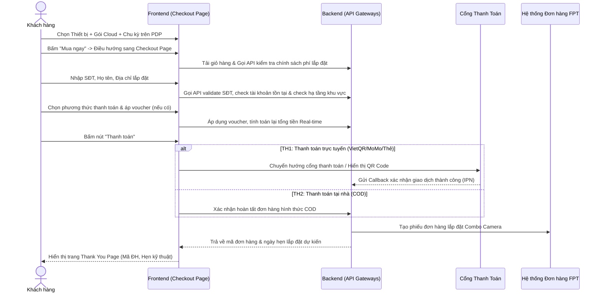

# USER REQUIREMENTS DOCUMENT (URD) - LUỒNG CHECKOUT COMBO CAMERA

**Dự án:** FPT.VN - Hệ thống chuẩn hóa luồng Checkout cho dịch vụ FPT Camera
**Mã hiệu:** FPT-URD-CHK-COMBOCAM
**Phiên bản:** 1.0
**Tác giả:** Senior Business Analyst / Product Owner
**Ngày lập:** 27/05/2026

---

## REVISION HISTORY (LỊCH SỬ THAY ĐỔI)
*Ký hiệu hành động: [A]: Add – Thêm mới | [U]: Update – Cập nhật, thay đổi | [D]: Delete - Xóa*

| Date | Version | Author | Action | Change Description |
| :--- | :--- | :--- | :---: | :--- |
| 27/05/2026 | V1.0 | Senior BA / PO | [A] | Khởi tạo tài liệu URD đặc tả luồng Mua hàng và Thanh toán (Checkout) tích hợp sản phẩm Combo Camera (Thiết bị phần cứng + Gói Cloud lưu trữ). |

---

## MỤC LỤC
A. GIỚI THIỆU
B. TỔNG QUAN LUỒNG NGHIỆP VỤ & PHÂN QUYỀN
C. ĐẶC TẢ CHI TIẾT CÁC CHỨC NĂNG & GIAO DIỆN
D. YÊU CẦU PHI CHỨC NĂNG
E. PHỤ LỤC & TÀI LIỆU THAM KHẢO

---

## A. GIỚI THIỆU

### 1. Mục đích tài liệu
Tài liệu này đặc tả chi tiết yêu cầu người dùng (URD) đối với luồng Mua hàng và Thanh toán (Checkout) tích hợp sản phẩm **Combo Camera** trên nền tảng kênh bán lẻ trực tuyến FPT.VN (bao gồm các kênh website tongdaiwifi.com, ứng dụng di động).
Tài liệu này làm cơ sở duy nhất cho:
- Đội ngũ UI/UX thiết kế giao diện chi tiết (Wireframes/Figma).
- Đội ngũ Lập trình (Frontend/Backend) phát triển giải pháp hệ thống và tích hợp API.
- Đội ngũ Kiểm thử (QA/QC) xây dựng kịch bản và tiến hành nghiệm thu sản phẩm (UAT).

### 2. Thông tin chung
| STT | HẠNG MỤC | MÔ TẢ CHI TIẾT |
| :---: | :--- | :--- |
| 1 | **Giới thiệu tổng quan** | **Combo Camera** là sản phẩm kết hợp giữa thiết bị phần cứng (Camera giám sát trong nhà - Indoor/ Camera ngoài trời - Outdoor) và Dịch vụ lưu trữ dữ liệu điện toán đám mây (Cloud Storage) của FPT. Thay vì bán rời rạc thiết bị và gói Cloud, luồng Checkout Combo Camera hỗ trợ khách hàng đăng ký trọn gói trên cùng một hành trình khép kín, tối ưu trải nghiệm người dùng cuối. |
| 2 | **Hiện trạng hệ thống (AS-IS)**| Hiện nay, quy trình đăng ký FPT Camera đang gặp một số bất cập: 1. Khách hàng phải mua riêng thiết bị phần cứng, sau đó kỹ thuật viên đến nhà lắp đặt mới hướng dẫn mua gói lưu trữ Cloud, dẫn đến quy trình rườm rà và chậm kích hoạt. 2. Chưa hỗ trợ hình thức thanh toán COD (thanh toán tại nhà sau khi lắp đặt xong hoàn thiện cả combo), làm khách hàng e ngại khi thanh toán trực tuyến 100% trước khi nhận thiết bị. |
| 3 | **Mục tiêu kỳ vọng (TO-BE)** | 1. Triển khai luồng mua trọn gói **Combo Camera (Thiết bị + Cloud)** trên cùng một hành trình One-page checkout. 2. Tăng tỷ lệ chuyển đổi đơn hàng thành công (CR) nhờ tối ưu hóa các bước điền thông tin và hiển thị rõ ràng chính sách khuyến mãi. 3. Thúc đẩy bán chéo các gói Cloud chu kỳ dài (6 tháng, 12 tháng) thông qua các chính sách miễn phí thiết bị hoặc miễn phí lắp đặt. |
| 4 | **Phạm vi triển khai** | **- Phạm vi kỹ thuật:** Hệ thống Web Portal FPT.VN (Desktop/Mobile Web), App Khách hàng, Backend API Gateways, CMS Admin cấu hình sản phẩm/khuyến mãi, tích hợp Cổng thanh toán (VietQR, MoMo, Thẻ quốc tế) và SMS Gateway. **- Phạm vi nghiệp vụ:** Bao phủ toàn bộ hành trình từ cấu hình combo trên trang chi tiết sản phẩm (PDP) -> Trang điền thông tin thanh toán & địa chỉ -> Trang hoàn tất giao dịch (Thank You Page). **- Phạm vi tổ chức:** Áp dụng cho khách hàng cá nhân và hộ gia đình đăng ký mới hoặc lắp đặt thêm thiết bị FPT Camera trên toàn quốc. |

### 3. Thuật ngữ và viết tắt
| STT | THUẬT NGỮ | NGHĨA TIẾNG ANH / TÊN ĐẦY ĐỦ | MÔ TẢ Ý NGHĨA |
| :---: | :--- | :--- | :--- |
| 1 | URD | User Requirements Document | Tài liệu yêu cầu người dùng |
| 2 | PDP | Product Detail Page | Trang chi tiết sản phẩm |
| 3 | Cloud Storage | Dịch vụ lưu trữ đám mây | Gói lưu trữ video của Camera an ninh thay cho thẻ nhớ |
| 4 | COD | Cash On Delivery | Thanh toán tại nhà sau khi kỹ thuật lắp đặt hoàn tất |
| 5 | SMS Gateway | Cổng tin nhắn thương hiệu | Hệ thống gửi tin nhắn kích hoạt/thông tin tài khoản qua SMS |
| 6 | SPF | Sales Processing Framework | Hệ thống xử lý đơn hàng bán lẻ của FPT Telecom |

---

## B. TỔNG QUAN LUỒNG NGHIỆP VỤ & PHÂN QUYỀN

### 1. Sơ đồ luồng nghiệp vụ tổng quan (Business Workflow)
Dưới đây là sơ đồ Sequence Diagram thể hiện tương tác hệ thống khi người dùng thực hiện giao dịch Combo Camera:

### 2. Danh sách các chức năng (Functional List)
| STT | Module / Chức năng | Version | Loại (New/Update) | Mô tả tóm tắt hành vi hệ thống |
| :---: | :--- | :---: | :---: | :--- |
| 1 | **Trang chi tiết sản phẩm (PDP) - Cấu hình Combo** | V1.0 | New | Cho phép khách hàng chọn loại Camera, số lượng thiết bị, gói lưu trữ Cloud (3 ngày/7 ngày/14 ngày) và chu kỳ trả trước (6 tháng/12 tháng). |
| 2 | **Trang điền thông tin và địa chỉ lắp đặt** | V1.0 | New | Thu thập thông tin SĐT, họ tên, địa chỉ lắp đặt 3 cấp (Tỉnh/Thành, Quận/Huyện, Phường/Xã) và phân loại nhà (Nhà riêng/Chung cư) để phục vụ thi công. |
| 3 | **Logic kiểm tra tài khoản & hiển thị thông báo** | V1.0 | New | Tự động kiểm tra SĐT trên hệ thống FPT Camera để hiển thị thông báo liên kết tài khoản cũ hoặc tự động tạo tài khoản mới. |
| 4 | **Động cơ tính phí lắp đặt & áp dụng Voucher** | V1.0 | New | Tự động tính phí lắp đặt/vận chuyển dựa trên địa chỉ và chu kỳ cước Cloud. Áp dụng các voucher giảm giá phần cứng/Cloud theo logic loại trừ lẫn nhau. |
| 5 | **Trang hoàn tất đơn hàng (Thank You Page)** | V1.0 | New | Xác nhận đặt hàng thành công, hiển thị mã đơn hàng SPF, thông tin đối soát và ngày hẹn lắp đặt tự động. Chặn hành vi back/reload trang. |

### 3. Ma trận quyền (Permission Matrix)

#### Bảng Định nghĩa Quyền (Permission Definition List)
| Mã Quyền | Tên Quyền | Mô tả chi tiết hành vi |
| :---: | :--- | :--- |
| **F** | Full Access | Toàn quyền thao tác cấu hình sản phẩm, giá bán, phí lắp đặt trên CMS. |
| **A** | Add | Tạo đơn hàng mới từ phía khách hàng (đặt hàng trực tuyến). |
| **V** | View | Xem thông tin chi tiết đơn hàng, trạng thái thanh toán và thông tin giao dịch. |
| **L** | List | Xem danh sách đơn hàng dưới dạng bảng phục vụ quản lý, đối soát. |

#### Bảng Phân quyền Module (Permission Matrix Table)
| STT | Tên Chức năng / Module | Role Admin CMS | Role Nhân viên QA/Kỹ thuật | Role Khách hàng cuối | Ghi chú |
| :---: | :--- | :---: | :---: | :---: | :--- |
| 1 | Cấu hình giá thiết bị, gói Cloud & Chu kỳ | F | V, L | N/A | Chỉ Admin được cấu hình giá |
| 2 | Cấu hình Phí lắp đặt theo từng khu vực | F | V | N/A | Admin cấu hình phí lắp đặt |
| 3 | Tạo đơn hàng Checkout Combo Camera | V, L | N/A | A | Khách hàng thực hiện checkout |
| 4 | Theo dõi trạng thái lắp đặt đơn hàng | V, L | V, L | V (Qua link mã ĐH) | Khách hàng tra cứu trạng thái ĐH |

---

## C. ĐẶC TẢ CHI TIẾT CÁC CHỨC NĂNG & GIAO DIỆN

### I. Màn hình Chi tiết Sản phẩm (PDP - Combo Camera)

#### 1. Luồng Nghiệp Vụ (Business Workflow)
- **Tác nhân tham gia:** Khách hàng.
- **Điều kiện bắt đầu:** Khách hàng truy cập trang chi tiết sản phẩm FPT Camera (Ví dụ: FPT Camera Play 3i hoặc FPT Camera SE 3).
- **Luồng xử lý chi tiết (Step-by-step):**
  - **Bước 1:** Hệ thống hiển thị hình ảnh sản phẩm, các đặc tính kỹ thuật, giá thiết bị phần cứng gốc và các nút tùy chọn cấu hình dịch vụ đi kèm.
  - **Bước 2:** Khách hàng lựa chọn **Gói lưu trữ Cloud** (3 ngày, 7 ngày hoặc 14 ngày).
  - **Bước 3:** Khách hàng lựa chọn **Chu kỳ thanh toán** cước Cloud (6 tháng hoặc 12 tháng).
  - **Bước 4:** Khách hàng chọn **Số lượng** bộ Combo cần mua (từ 1 đến 10 bộ).
  - **Bước 5:** Hệ thống thực hiện tính toán giá tự động (Real-time recalculate) và hiển thị tổng tiền tạm tính bao gồm: Giá thiết bị đã giảm + Giá gói Cloud tương ứng chu kỳ.
  - **Bước 6:** Khách hàng nhấn nút "Mua ngay", hệ thống ghi nhận giỏ hàng và điều hướng khách hàng sang màn hình Checkout.

#### 2. Quy tắc Nghiệp Vụ (Business Rules)
| Mã Rule | Tên Quy tắc | Nội dung quy tắc chi tiết |
| :---: | :--- | :--- |
| **PDP-BR-01** | Chọn mặc định thông minh | Để tối ưu hóa thao tác người dùng, hệ thống mặc định chọn sẵn tùy chọn phổ biến nhất khi tải trang: - Gói Cloud mặc định: **7 ngày**. - Chu kỳ thanh toán mặc định: **6 tháng**. - Số lượng mặc định: **1**. |
| **PDP-BR-02** | Ràng buộc đồng bộ số lượng | Vì đây là luồng bán **Combo thiết bị + dịch vụ**, nên **Số lượng gói Cloud đăng ký phải luôn bằng Số lượng thiết bị phần cứng**. Ví dụ: Khách hàng mua 3 Camera thì hệ thống tự động nhân số lượng gói Cloud lên 3 tương ứng (không cho phép mua 3 Camera nhưng chỉ đăng ký 1 gói Cloud trên luồng này). |
| **PDP-BR-03** | Khuyến mãi tặng tháng cước | Cấu hình ưu đãi chu kỳ dài hạn trực tiếp trên giao diện: - Chọn chu kỳ **6 tháng**: Không tặng thêm tháng. - Chọn chu kỳ **12 tháng**: Tặng thêm **1 tháng sử dụng Cloud miễn phí** (hiển thị nhãn nổi bật: *"Tặng 1 tháng"* trên radio button của chu kỳ). |

#### 3. Mô tả Giao diện & Ràng buộc Trường (Screen Description)
| STT | Field / Element | Kiểu dữ liệu | Ràng buộc dữ liệu / Validation | Liên kết Rule | Thao tác người dùng & Phản hồi hệ thống |
| :---: | :--- | :--- | :--- | :---: | :--- |
| 1 | **Gói lưu trữ Cloud** | Radio Button Group | - Bắt buộc chọn 1 trong 3 tùy chọn: 3 ngày, 7 ngày, 14 ngày. | PDP-BR-01 | - Người dùng: Click chọn gói lưu trữ. - Hệ thống: Cập nhật đơn giá Cloud hiển thị ở phía dưới và tính lại tổng tiền. |
| 2 | **Chu kỳ thanh toán** | Radio Button Group | - Bắt buộc chọn 1 trong 2 tùy chọn: 6 tháng, 12 tháng. | PDP-BR-01 PDP-BR-03 | - Người dùng: Click chọn chu kỳ. - Hệ thống: Cập nhật lại thời hạn gói cước, áp dụng logic tặng tháng cước (nếu có) và tính lại tổng tiền. |
| 3 | **Số lượng** | Number Input (+/-) | - Min = 1, Max = 10. - Chỉ cho phép nhập số nguyên. | PDP-BR-02 | - Người dùng: Click nút `+` hoặc `-` hoặc nhập trực tiếp. - Hệ thống: Nhân số lượng thiết bị và số lượng gói Cloud tương đương, cập nhật tổng tiền tạm tính. |
| 4 | **Tổng tiền tạm tính** | Text Display | - Chỉ đọc (Read-only). - Hiển thị dạng tiền tệ (VNĐ). | N/A | - Hệ thống: Tự động cập nhật tức thời khi khách hàng thay đổi bất kỳ trường cấu hình nào phía trên. |
| 5 | **Nút "Mua ngay"** | Button | - Luôn active. | N/A | - Người dùng: Click nút. - Hệ thống: Đưa sản phẩm vào session giỏ hàng và điều hướng sang trang `/checkout`. |

#### 4. Các trường hợp lỗi & Thông báo hiển thị (Error Messages)
| STT | Giai đoạn / Tình huống | Thông báo hiển thị chính xác | Hành vi UI & Xử lý hệ thống |
| :---: | :--- | :--- | :--- |
| 1 | Khách hàng cố tình nhập số lượng `< 1` | *"Số lượng sản phẩm tối thiểu là 1 bộ combo!"* | Tự động reset giá trị trường số lượng về `1`, hiển thị thông báo dạng tooltip cảnh báo màu cam và tính toán lại giá. |
| 2 | Khách hàng nhập số lượng `> 10` | *"Để đăng ký số lượng lớn hơn 10 camera, vui lòng liên hệ hotline 1900 6600 để được hỗ trợ doanh nghiệp!"* | Tự động reset giá trị trường số lượng về `10`, hiển thị popup thông báo hỗ trợ doanh nghiệp. |

---

### II. Màn hình Thanh toán (Checkout Page)

#### 1. Luồng Nghiệp Vụ (Business Workflow)
- **Tác nhân tham gia:** Khách hàng.
- **Pre-conditions:** Khách hàng đã cấu hình combo thành công từ trang PDP và đang ở màn hình Checkout.
- **Luồng xử lý chi tiết (Step-by-step):**
  - **Bước 1:** Màn hình checkout One-page hiển thị: Khối nhập thông tin cá nhân & Địa chỉ lắp đặt ở bên trái; Khối tóm tắt đơn hàng, áp Voucher & Phương thức thanh toán ở bên phải (Sidebar).
  - **Bước 2:** Khách hàng nhập Số điện thoại. Hệ thống tự động gọi API ngầm để kiểm tra trạng thái tài khoản Camera liên kết với SĐT này.
  - **Bước 3:** Khách hàng nhập Họ tên, Email và chọn Địa chỉ lắp đặt chi tiết (Tỉnh/Thành -> Quận/Huyện -> Phường/Xã -> Số nhà/Tên đường).
  - **Bước 4:** Khách hàng chọn loại hình nhà (Nhà riêng hoặc Chung cư) để hệ thống thu thập thông tin lắp đặt đặc thù.
  - **Bước 5:** Khách hàng chọn Phương thức thanh toán (VietQR, Ví MoMo, Thẻ quốc tế hoặc COD).
  - **Bước 6:** Khách hàng áp dụng mã khuyến mãi Voucher (nếu có). Hệ thống tính toán lại phí lắp đặt và tổng thanh toán cuối cùng (Real-time).
  - **Bước 7:** Khách hàng bấm nút "Thanh toán" để tiến hành xử lý đơn hàng.

#### 2. Quy tắc Nghiệp Vụ (Business Rules)
##### **[CASE 1] Validate Số điện thoại & Kiểm tra Tài khoản (FPT Camera Account)**
- SĐT là trường thông tin bắt buộc, dùng để liên lạc lắp đặt và đồng thời là tài khoản đăng nhập ứng dụng FPT Camera để xem Cloud.
- Hệ thống gọi API check trạng thái SĐT trên DB FPT Camera:
  - **Trường hợp 1 (SĐT đã có tài khoản Camera):** Hiển thị inline text thông báo màu xanh dưới trường SĐT: *"Số điện thoại này đã có tài khoản FPT Camera. Gói Cloud mua mới sẽ được tự động kích hoạt vào tài khoản hiện tại của bạn."*
  - **Trường hợp 2 (SĐT chưa có tài khoản Camera):** Hiển thị inline text thông báo màu xám dưới trường SĐT: *"Hệ thống sẽ tự động tạo tài khoản FPT Camera cho bạn bằng số điện thoại này. Mật khẩu kích hoạt sẽ được gửi qua SMS sau khi lắp đặt thành công."*

##### **[CASE 2] Ràng buộc Loại nhà (Nhà riêng vs Chung cư)**
Địa chỉ thi công lắp đặt camera phụ thuộc lớn vào loại hình nhà để kỹ thuật viên chuẩn bị trang thiết bị (thang dây, dây cáp mạng dài...).
- Nếu khách hàng chọn **"Nhà riêng"**: Mặc định hiển thị trường nhập **"Số nhà, tên đường"** (Trường bắt buộc). Ẩn các trường thông tin chung cư.
- Nếu khách hàng chọn **"Chung cư"**: Hệ thống ẩn trường số nhà bình thường và hiển thị 2 trường bắt buộc thay thế:
  1. **Tên tòa nhà / Block** (Dropdown hoặc Textbox - Bắt buộc).
  2. **Số căn hộ / Tầng** (Textbox - Bắt buộc).

##### **[CASE 3] Logic tính Phí lắp đặt & Vận chuyển**
Hệ thống tự động tính phí lắp đặt dựa trên chu kỳ gói Cloud lưu trữ để khuyến khích khách hàng đăng ký dài hạn:
- Nếu chu kỳ cước Cloud là **6 tháng hoặc 12 tháng**: **Miễn phí hoàn toàn chi phí lắp đặt & vận chuyển** (Phí lắp đặt hiển thị ở Sidebar: `0đ` - Kèm nhãn nổi bật: *"Miễn phí lắp đặt"* màu xanh lá).
- Nếu khách hàng mua thiết bị không kèm Cloud (hoặc chọn gói Cloud thanh toán từng tháng - cấu hình mở rộng): Tính phí lắp đặt mặc định là **110.000đ/thiết bị** (Tổng phí lắp đặt = 110.000đ x Số lượng thiết bị).

##### **[CASE 4] Ràng buộc áp dụng Voucher (Khuyến mãi)**
- Khách hàng có thể nhập mã voucher thủ công. Hệ thống phân loại voucher thành 2 nhóm:
  - *Voucher phần cứng:* Giảm giá trực tiếp trên giá bán Camera.
  - *Voucher Cloud:* Giảm giá trực tiếp trên tiền cước Cloud hoặc tặng thêm tháng cước Cloud.
- **Ràng buộc loại trừ:** Chỉ cho phép áp dụng tối đa **1 mã voucher** trên một đơn hàng. Không cho phép cộng dồn nhiều voucher cùng lúc. Nếu khách hàng nhập mã mới, mã cũ sẽ bị ghi đè sau khi có xác nhận đồng ý từ khách hàng.

##### **[CASE 5] Giới hạn Phương thức Thanh toán tại nhà (COD)**
- Phương thức COD (Thanh toán tại nhà sau khi kỹ thuật viên lắp đặt hoàn tất) là đặc quyền chỉ áp dụng tại các khu vực có hạ tầng kỹ thuật và đội ngũ triển khai trực tiếp của FPT Telecom.
- **Logic kiểm tra:** Khi khách hàng chọn xong địa chỉ (Tỉnh/Thành -> Quận/Huyện):
  - Nếu khu vực đó nằm trong **Danh sách hỗ trợ thi công của FPT** (load động từ CMS): Cho phép chọn phương thức COD.
  - Nếu khu vực đó không hỗ trợ triển khai trực tiếp (khu vực huyện đảo, vùng sâu vùng xa chưa có chi nhánh FPT): **Disable phương thức COD** (ẩn mờ hoặc hiển thị tooltip cảnh báo). Hệ thống yêu cầu khách hàng chọn các phương thức thanh toán trực tuyến (VietQR, Thẻ...) và giao thiết bị qua đường bưu điện (khách hàng tự lắp đặt theo tài liệu hướng dẫn trực tuyến).

#### 3. Mô tả Giao diện & Ràng buộc Trường (Screen Description)
| STT | Khối thông tin | Tên trường | Kiểu dữ liệu | Ràng buộc dữ liệu / Validation | Liên kết Rule | Hành vi hệ thống & Thao tác người dùng |
| :---: | :--- | :--- | :--- | :--- | :---: | :--- |
| 1 | Cá nhân | **Họ và tên** | Textbox | - Bắt buộc nhập. - Không chứa số/ký tự đặc biệt. - Max 50 ký tự. | N/A | Người dùng nhập họ tên. Hệ thống tự động viết hoa chữ cái đầu. |
| 2 | Cá nhân | **Số điện thoại** | Textbox | - Bắt buộc nhập. - Chỉ cho phép nhập số. - Đúng định dạng số di động VN (10 số). | [CASE 1] | Người dùng nhập SĐT. Hệ thống gọi API kiểm tra tài khoản và hiển thị thông báo inline tương ứng. |
| 3 | Địa chỉ | **Tỉnh/Thành phố** | Dropdown | - Bắt buộc chọn. - Dữ liệu load từ API Master Data. | [CASE 5] | Khách hàng chọn Tỉnh. Hệ thống tự động load danh sách Quận/Huyện tương ứng. |
| 4 | Địa chỉ | **Quận/Huyện** | Dropdown | - Bắt buộc chọn. - Phụ thuộc vào Tỉnh/Thành. | [CASE 5] | Khách hàng chọn Huyện. Hệ thống tự động load danh sách Phường/Xã và kiểm tra điều kiện hỗ trợ COD. |
| 5 | Địa chỉ | **Phường/Xã** | Dropdown | - Bắt buộc chọn. - Phụ thuộc vào Quận/Huyện. | N/A | Khách hàng chọn Phường/Xã. |
| 6 | Địa chỉ | **Loại nhà** | Radio Group | - Mặc định chọn "Nhà riêng". - 2 option: Nhà riêng / Chung cư. | [CASE 2] | - Người dùng chọn Chung cư: Hệ thống ẩn trường "Số nhà" và hiển thị các trường Tòa nhà, Căn hộ. - Người dùng chọn Nhà riêng: Reset hiển thị ban đầu. |
| 7 | Địa chỉ | **Số nhà, tên đường** | Textbox | - Bắt buộc nhập nếu chọn Loại nhà là "Nhà riêng". - Max 100 ký tự. | [CASE 2] | Khách hàng nhập số nhà và tên đường chi tiết. |
| 8 | Địa chỉ | **Tên tòa nhà/Block** | Textbox | - Bắt buộc nhập nếu chọn Loại nhà là "Chung cư". | [CASE 2] | Khách hàng nhập tên tòa nhà (Ví dụ: Block A, Tòa Landmark 81). |
| 9 | Địa chỉ | **Căn hộ / Tầng** | Textbox | - Bắt buộc nhập nếu chọn Loại nhà là "Chung cư". | [CASE 2] | Khách hàng nhập số căn hộ và số tầng (Ví dụ: Căn 12.05, Tầng 12). |
| 10 | Thanh toán | **Phương thức TT** | Radio Group | - Bắt buộc chọn 1. - Các option: VietQR, MoMo, Thẻ quốc tế, COD. | [CASE 5] | Khách hàng chọn phương thức. Nếu chọn VietQR/MoMo: hiển thị text thông tin ưu đãi giảm giá (nếu có). |
| 11 | Tóm tắt | **Mã khuyến mãi** | Textbox | - Không bắt buộc. - Cho phép nhập text/số. | [CASE 4] | Khách hàng nhập mã -> Click "Áp dụng". Hệ thống gọi API kiểm tra tính hợp lệ và trừ tiền trực tiếp trên Sidebar. |
| 12 | Tóm tắt | **Nút "Thanh toán"** | Button | - Chỉ active khi tất cả các trường bắt buộc phía trên đã điền hợp lệ. | N/A | Khách hàng click. Hệ thống kiểm tra tổng thể lần cuối, khóa màn hình bằng overlay loading và chuyển hướng xử lý thanh toán. |

#### 4. Các trường hợp lỗi & Thông báo hiển thị (Error Messages & UI Scenarios)
| STT | Giai đoạn | Tình huống lỗi | Thông báo hiển thị chính xác | Hành vi UI & Xử lý hệ thống |
| :---: | :--- | :--- | :--- | :--- |
| 1 | **Nhập liệu** | SĐT sai định dạng hoặc thiếu số | *"Số điện thoại không hợp lệ! Vui lòng nhập đúng 10 chữ số di động."* | Hiển thị text đỏ cảnh báo ngay dưới trường SĐT. Viền trường chuyển sang màu đỏ. Disable nút Thanh toán. |
| 2 | **Nhập liệu** | Chọn "Chung cư" nhưng bỏ trống trường Tòa nhà | *"Vui lòng nhập tên tòa nhà / block chung cư để kỹ thuật viên định vị khu vực thi công!"* | Focus vào trường Tòa nhà, hiển thị cảnh báo lỗi viền đỏ. |
| 3 | **Địa chỉ** | Chọn khu vực huyện đảo không hỗ trợ thi công và click chọn COD | *"Phương thức Thanh toán tại nhà (COD) chưa được hỗ trợ tại khu vực của bạn. Vui lòng thanh toán trực tuyến để chúng tôi chuyển phát thiết bị qua bưu điện!"* | Hiển thị Alert Popup cảnh báo. Tự động reset lựa chọn phương thức thanh toán về "VietQR" (mặc định trực tuyến). |
| 4 | **Áp Voucher**| Voucher đã hết hạn sử dụng | *"Mã khuyến mãi đã hết hạn sử dụng. Vui lòng kiểm tra lại thời gian diễn ra chương trình!"* | Hiển thị thông báo đỏ ngay dưới ô nhập voucher. Loại bỏ voucher và giữ nguyên giá trị tổng tiền thanh toán cũ. |
| 5 | **Thanh toán**| Lỗi kết nối Cổng thanh toán (Gateway Timeout) | *"Không thể kết nối đến cổng thanh toán. Giao dịch của bạn chưa bị trừ tiền. Vui lòng thử lại sau ít phút hoặc đổi phương thức thanh toán!"* | Hiển thị Popup lỗi dạng thông báo. Giữ nguyên toàn bộ thông tin đã nhập trên màn hình Checkout để khách hàng chọn lại phương thức thanh toán khác hoặc thử lại mà không phải nhập lại từ đầu. |

---

### III. Màn hình Hoàn tất đơn hàng (Thank You Page)

#### 1. Luồng Nghiệp Vụ (Business Workflow)
- **Tác nhân tham gia:** Khách hàng.
- **Pre-conditions:** Khách hàng đã thực hiện thanh toán trực tuyến thành công (hoặc xác nhận đơn hàng COD thành công ở bước trước).
- **Luồng xử lý chi tiết (Step-by-step):**
  - **Bước 1:** Hệ thống nhận callback thành công từ cổng thanh toán (hoặc nhận lệnh lưu đơn COD thành công từ backend), tiến hành lưu đơn hàng vào hệ thống SPF.
  - **Bước 2:** Hệ thống tự động tính toán **Ngày hẹn lắp đặt dự kiến** dựa trên lịch làm việc của chi nhánh FPT gần nhất theo địa chỉ lắp đặt.
  - **Bước 3:** Hệ thống điều hướng khách hàng đến màn hình Thank You Page.
  - **Bước 4:** Hiển thị thông báo chúc mừng đặt hàng thành công, hiển thị Mã đơn hàng SPF và thông tin tóm tắt đơn hàng để đối soát.
  - **Bước 5:** Đồng thời gửi một SMS kích hoạt đơn hàng và thông tin tài khoản qua tin nhắn SMS thương hiệu FPT Telecom cho khách hàng.

#### 2. Quy tắc Nghiệp Vụ (Business Rules)
| Mã Rule | Tên Quy tắc | Nội dung quy tắc chi tiết |
| :---: | :--- | :--- |
| **TYP-BR-01** | Khóa nút Back trình duyệt | Để ngăn chặn hành vi khách hàng bấm nút quay lại (Back) trên trình duyệt dẫn đến việc gửi yêu cầu thanh toán kép hoặc tạo trùng lặp đơn hàng trên hệ thống SPF, **giao diện Thank You Page phải hoàn toàn vô hiệu hóa nút Back của trình duyệt**. Nếu người dùng cố tình Back, hệ thống tự động redirect giữ họ ở trang Thank You Page hoặc đưa về Trang chủ FPT.VN. |
| **TYP-BR-02** | Tính toán ngày lắp đặt tự động | Ngày hẹn lắp đặt dự kiến hiển thị cho khách hàng được tính theo công thức: **Ngày_Hẹn = Ngày_Đặt_Hàng + 2 ngày làm việc** (loại trừ Chủ nhật). Ví dụ: Đặt hàng vào Thứ 6 thì ngày hẹn lắp đặt dự kiến hiển thị là Thứ 2 tuần kế tiếp. |
| **TYP-BR-03** | Quy chuẩn mã đơn hàng SPF | Mã đơn hàng hiển thị phải là mã SPF định dạng chuẩn để dễ dàng đối soát hệ thống (Ví dụ: `FPTCAM12345678X`). Mã này được tạo duy nhất và không trùng lặp. |

#### 3. Mô tả Giao diện & Ràng buộc Trường (Screen Description)
| STT | Khối hiển thị | Nội dung hiển thị chi tiết | Ý nghĩa đối với người dùng |
| :---: | :--- | :--- | :--- |
| 1 | **Trạng thái đơn hàng** | - Icon tích xanh (Success Animation). - Dòng thông báo nổi bật: *"Đặt hàng thành công!"* | Xác nhận trực quan giúp khách hàng an tâm giao dịch đã hoàn tất. |
| 2 | **Thông tin đơn hàng** | - **Mã đơn hàng:** `FPTCAMXXXXXXXX` (Định dạng in đậm, có nút copy nhanh). - **Trạng thái:** *Đã thanh toán* (nếu chọn TT trực tuyến) hoặc *Chờ thanh toán khi lắp đặt* (nếu chọn COD). | Cung cấp mã tra cứu phục vụ đối soát và liên hệ tổng đài hỗ trợ khi cần. |
| 3 | **Lịch hẹn lắp đặt** | - **Thời gian lắp đặt dự kiến:** Thứ X, ngày Y/Z/2026. - **Lưu ý:** *Kỹ thuật viên FPT Telecom sẽ liên hệ trực tiếp với bạn qua SĐT đăng ký trước khi đến 30 phút.* | Giúp khách hàng chủ động sắp xếp thời gian có mặt tại địa chỉ lắp đặt để tiếp đón kỹ thuật viên. |
| 4 | **Tóm tắt sản phẩm** | - Hiển thị chi tiết số lượng Camera (Indoor/Outdoor). - Chi tiết gói Cloud (thời gian lưu trữ, số lượng gói, thời hạn sử dụng). - Tổng số tiền đã thanh toán (hoặc cần thanh toán khi nhận hàng). | Giúp khách hàng kiểm tra lại chính xác các hạng mục dịch vụ và thiết bị đã đăng ký. |
| 5 | **Nút điều hướng** | - **Nút "Về trang chủ":** Điều hướng về trang chủ FPT.VN. - **Nút "Theo dõi đơn hàng":** Dẫn đến trang tra cứu hành trình đơn hàng lắp đặt. | Cung cấp lối thoát giao diện tự nhiên và tăng tương tác giữ chân người dùng. |

---

## D. YÊU CẦU PHI CHỨC NĂNG

### 1. Hiệu năng hệ thống (Performance)
- **Thời gian tải trang (Page Load Time):** Thời gian tải toàn bộ tài nguyên giao diện trang Checkout không quá **1.5 giây** trong điều kiện kết nối 3G/4G thông thường.
- **Tốc độ tính toán Real-time (Recalculation Latency):** Logic tính phí vận chuyển, áp dụng voucher giảm giá và tính toán lại tổng tiền trên Sidebar phải thực hiện dưới **300ms** ngay sau khi người dùng thay đổi lựa chọn, đảm bảo không xảy ra tình trạng giật/đơ giao diện.
- **Tích hợp API không đồng bộ (Asynchronous API):** Việc kiểm tra trạng thái tài khoản Camera của SĐT phải được thực hiện ngầm không đồng bộ (Asynchronously) ngay khi người dùng nhập đủ 10 số, không được chặn (block) quá trình người dùng tiếp tục nhập các trường khác.

### 2. Bảo mật & An toàn thông tin (Security)
- **Mã hóa đường truyền (HTTPS/TLS):** Toàn bộ dữ liệu cá nhân (Họ tên, SĐT, Địa chỉ lắp đặt, Thông tin thanh toán) truyền tải giữa Client và Server phải được mã hóa qua giao thức an toàn HTTPS (sử dụng TLS 1.3).
- **Che dấu thông tin nhạy cảm (Data Masking):** 
  - Trên giao diện Thank You Page và các email xác nhận đơn hàng gửi tự động, số điện thoại khách hàng phải được che dấu một phần (Ví dụ: `098***5678`) để bảo vệ quyền riêng tư của khách hàng.
  - Tuyệt đối không lưu trữ thông tin thẻ tín dụng hay tài khoản ngân hàng của khách hàng trên database của hệ thống FPT.VN. Việc xử lý thanh toán phải được ủy quyền hoàn toàn cho đối tác cổng thanh toán đạt chứng chỉ quốc tế PCI-DSS.

### 3. Trải nghiệm người dùng & Giao diện (UI/UX)
- **Hỗ trợ tự động điền (Autofill & Autocomplete):** Giao diện các ô nhập liệu phải hỗ trợ thuộc tính chuẩn HTML5 để các trình duyệt trên di động (Safari, Chrome) có thể tự động điền thông tin Họ tên, SĐT và Email giúp giảm thiểu tối đa friction (ma sát) khi điền form.
- **Responsive 100%:** Thiết kế giao diện One-page checkout phải tương thích hoàn hảo trên các kích thước màn hình Mobile, Tablet và Desktop. Trên giao diện Mobile, khối Tóm tắt đơn hàng (Sidebar ở bản Desktop) sẽ được thu gọn thành một thanh ghim cố định ở cạnh dưới màn hình (sticky bottom bar) hiển thị tổng tiền và nút Thanh toán, cho phép click để mở rộng xem chi tiết sản phẩm.
- **Khóa màn hình khi xử lý (Session Protection):** Khi người dùng nhấn nút "Thanh toán", hệ thống phải lập tức hiển thị một lớp phủ mờ (Overlay Loading) chứa vòng xoay hoạt họa và dòng thông báo: *"Hệ thống đang xử lý giao dịch và khởi tạo đơn hàng lắp đặt, quý khách vui lòng không tắt hoặc tải lại trang web!"* nhằm bảo vệ luồng dữ liệu giao dịch.

---

## E. PHỤ LỤC & TÀI LIỆU THAM KHẢO
- **Link thiết kế UI/UX Figma chi tiết:** [Thiết kế luồng Checkout Combo Camera - Figma](https://figma.com/file/fpt-vn-checkout-combocam) *(Link giả định)*
- **Tài liệu đặc tả API Master Data (Tỉnh/Huyện/Xã):** [Đặc tả API Địa giới Hành chính](https://api.fpt.vn/docs/masterdata/location) *(Link giả định)*
- **Tài liệu tích hợp cổng thanh toán VietQR & MoMo:** [Đặc tả kết nối API Cổng thanh toán FPT](https://api.fpt.vn/docs/payment-gateway) *(Link giả định)*
